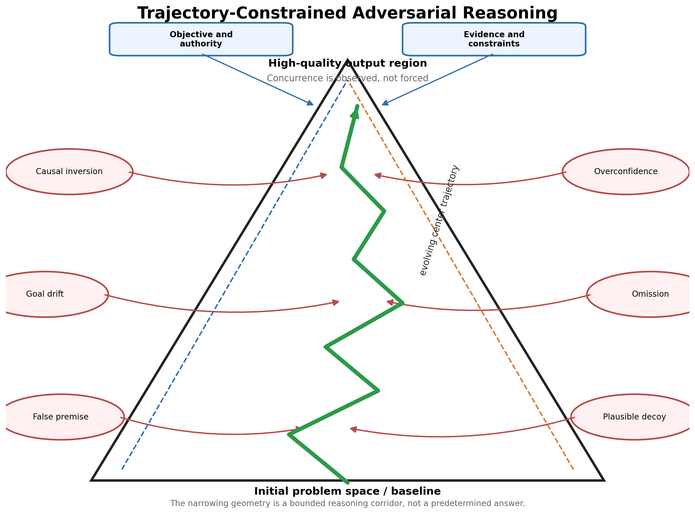
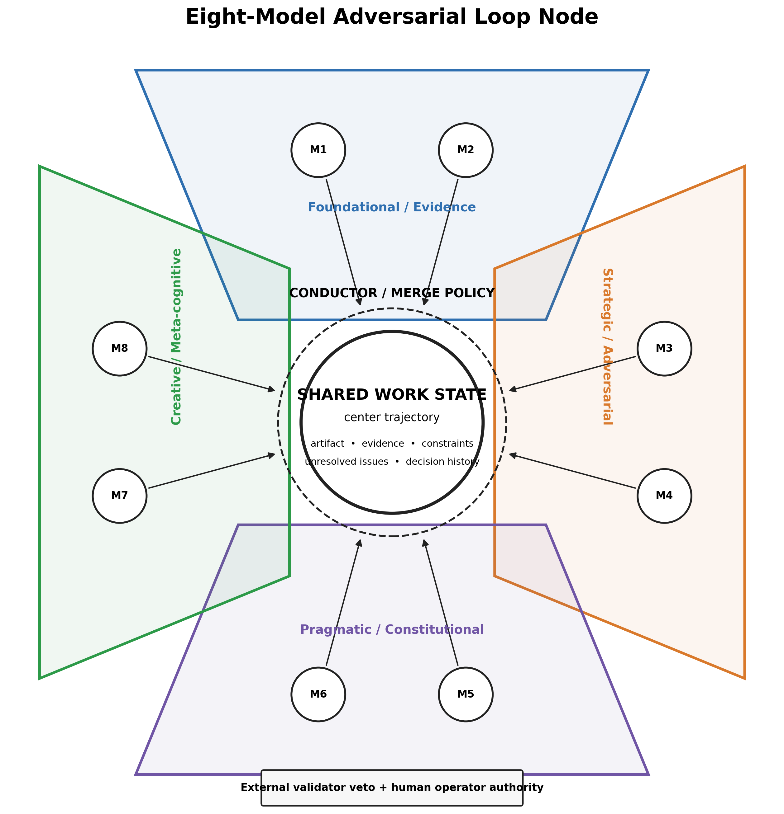
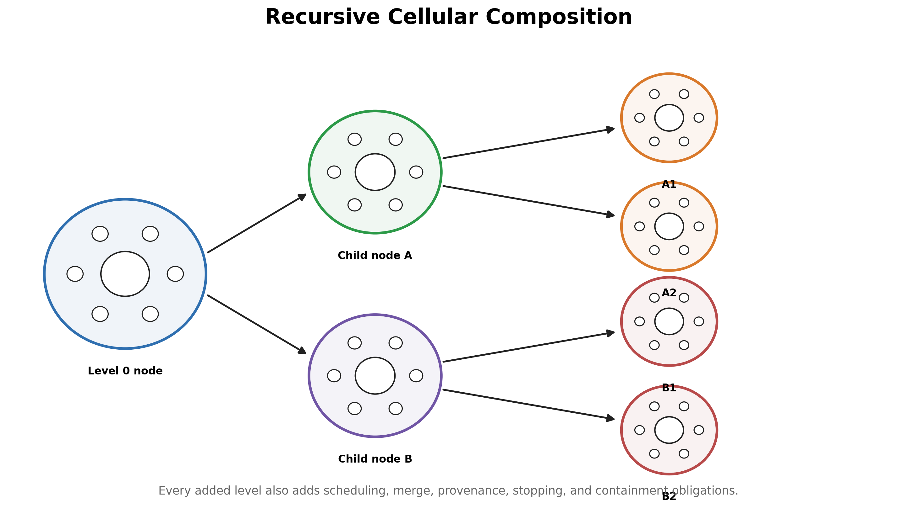
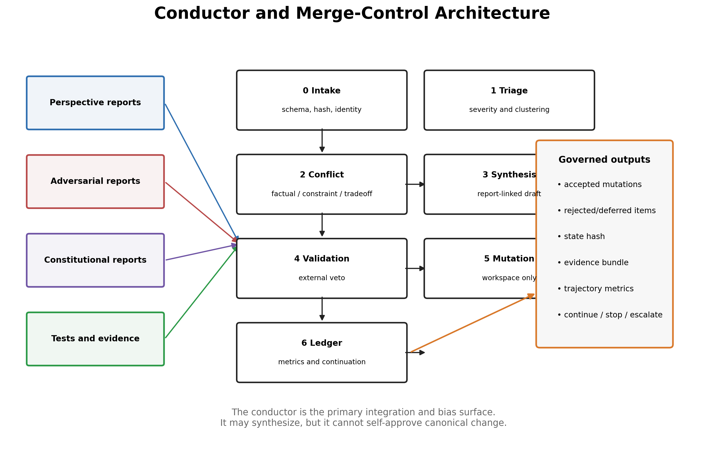
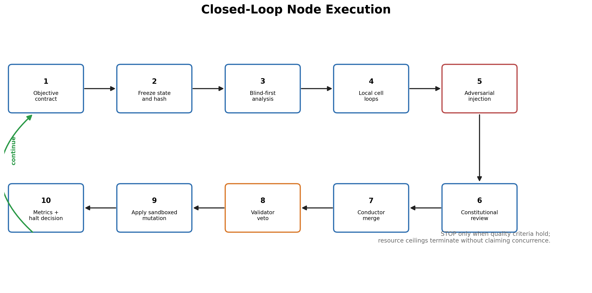
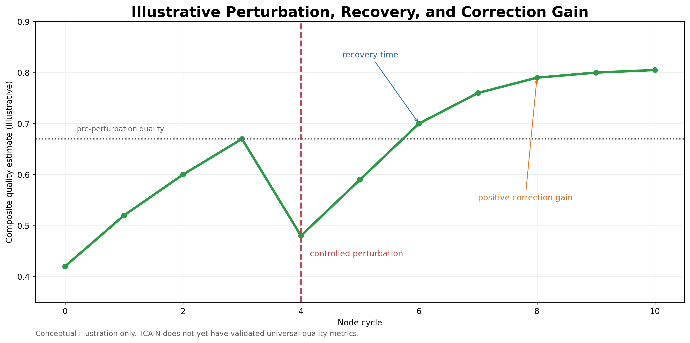
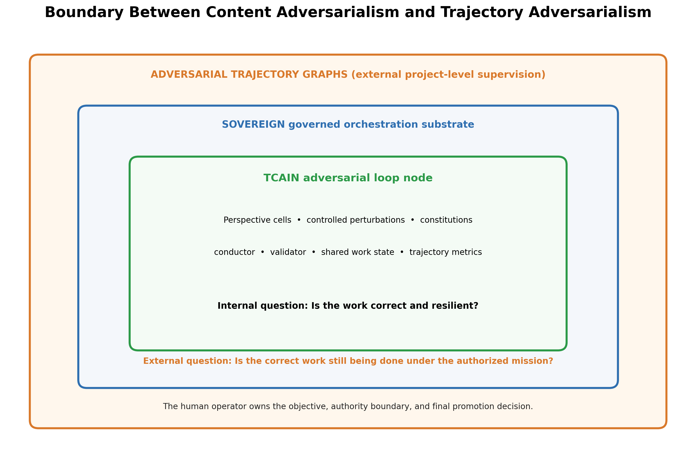
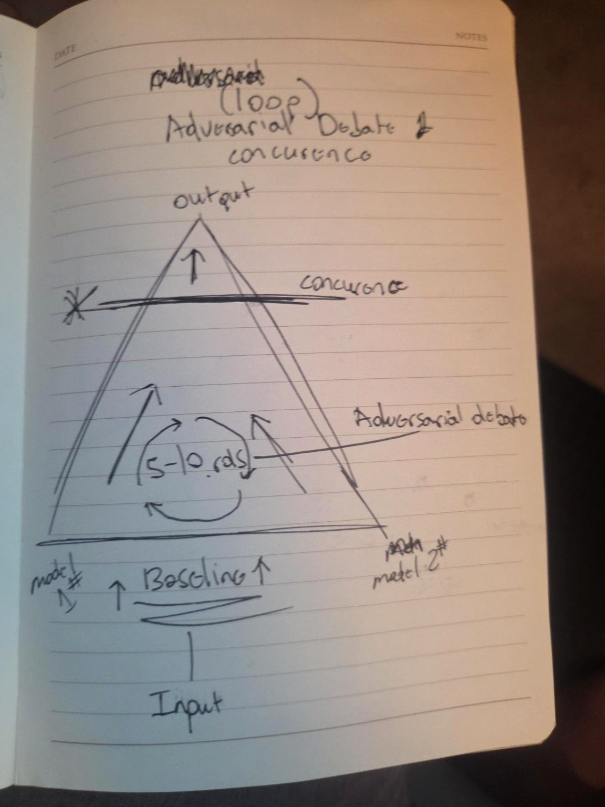
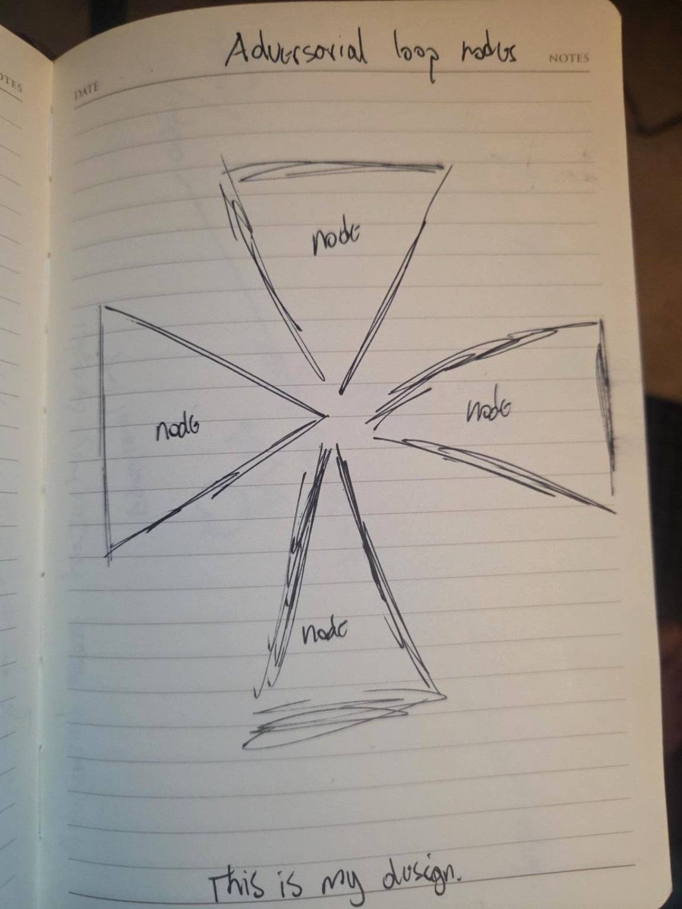

# Trajectory-Constrained Adversarial Intelligence Nodes

## A Working Thesis and Experimental Research Program for Multi-Model Reasoning Under Structured Perturbation, Constitutional Constraint, and Recursive Orchestration

**Author: Sam Flynn**  
**Research program:** Sovereign Systems Research Program · Dark Science Division  
**Edition:** Working Thesis v1.0 · July 30, 2026

| Document control | |
|---|---|
| Status | Working thesis and experimental prospectus. Not peer reviewed, not submitted as a degree dissertation, and not a validated performance claim. |
| Supersedes | TCAIN v0.2 (July 17, 2026), which superseded v0.1. |
| Normative core | Sections 4, 5, 8, 9, and Appendices B–E define the proposed architecture, contracts, merge policy, and test protocol. |
| Informative core | Sections 2, 3, 6, 7, 10–14 provide origin, lineage, hypotheses, evaluation, limitations, and research boundaries. |
| Evidence status | The conceptual design is documented. The complete eight-model node has not yet been benchmarked. All performance claims remain hypotheses. |
| Owner and final authority | Sam Flynn, human operator. No model, node, conductor, validator, or derived document may self-promote or alter the operator-owned objective. |

## Authorship and Development Provenance

The original architecture, visual topology, and governing intuition originate with **Sam Flynn**. The primary provenance artifacts are the handwritten triangle and four-directional node sketches reproduced in Appendix D. The originating concepts include: the distinction between trajectory and forced convergence; concurrence as an observed property rather than a required vote; adversarial engines positioned outside the reasoning course; deliberately controlled wrongness used to force self-questioning and course correction; written constitutions as a separate corrective pressure; four directional cells containing two models each; differentiated prompting across levels and perspectives; a governed center trajectory of work; and the possibility of recursively composing nodes as cells within larger nodes.

The formal vocabulary, related-work mapping, conductor analysis, state model, merge policy, metric proposals, threat model, experimental protocol, and publication structure were developed through an iterative, human-governed research dialogue between Sam Flynn and AI assistants. Those assistants served as analytical and editorial tools, not autonomous authors or final authorities. The author selected the objectives, corrected misunderstandings, supplied the core design, approved terminology, and retained final control over every claim. This report therefore attributes conceptual authorship to Sam Flynn while transparently acknowledging model-assisted formalization and drafting.

The paper deliberately preserves the difference between **origin** and **formalization**. The fact that later analysis connects the node to debate systems, blackboard architectures, constitutional control, sparse communication, resilient distributed inference, or control theory does not retroactively transfer authorship of the integrated concept to those literatures. Conversely, the presence of an original integration does not erase prior art. The candidate contribution is the specific architecture and research program described here, not ownership of every ingredient from which it is constructed.

# Abstract

This thesis develops **Trajectory-Constrained Adversarial Intelligence Nodes (TCAIN)**, a trajectory-first architecture for multi-model reasoning. Conventional language-model debate commonly optimizes an endpoint: agreement, a winning argument, majority selection, or synthesis after a fixed number of exchanges. TCAIN instead treats reasoning as an evolving, versioned work trajectory inside a bounded solution corridor. The central hypothesis is that direction, recovery, evidence accumulation, objective fidelity, and stability under pressure may be more informative and more controllable than endpoint agreement alone.

A TCAIN node centers an evolving shared work state rather than a transcript. Specialized perspective cells examine different levels of the same objective. The base topology contains four directional cells with two heterogeneous models each, producing an eight-model node. The models need not receive identical prompts, evidence, context, or constitutions. Some engines construct and verify the work. Others operate outside the center trajectory and inject controlled classes of plausible wrongness, including false premises, causal inversions, omissions, goal drift, overconfidence, temporal distortion, attractive decoys, authority escalation, and artifact-borne instruction injection. Their function is not to contribute the final answer. It is to create measurable pressure that forces the primary system to identify deviation, question itself, repair the work, and demonstrate recovery.

A separate constitutional channel checks whether the work remains inside operator-owned objectives, written constraints, evidence requirements, mutation boundaries, and authority rules. A conductor schedules engines, controls information exposure, reconciles valid but conflicting reports, proposes or applies permitted mutations, records provenance, updates trajectory metrics, and decides whether another cycle is justified. Because the conductor is the integration point, it is also the architecture's dominant bias and failure surface. TCAIN therefore separates synthesis from validation: an external validator may veto a merge, and canonical changes remain proposal-only until approved by the human operator.

This v1.0 thesis consolidates the original sketches, the trajectory/concurrence distinction, the outside-adversary concept, the constitutional layer, the eight-model node, the recursive-cell vision, the conductor problem, a preliminary formal model, a detailed runtime architecture, explicit schemas, a perturbation library, adaptive stopping, threat and failure analysis, an experimental program, and the relationship between TCAIN, the SOVEREIGN governance substrate, and the separate Adversarial Trajectory Graph (ATG) supervisory architecture. The paper distinguishes internal content adversarialism from external project-level trajectory adversarialism: TCAIN asks whether the work is correct and resilient; ATG asks whether the correct work is still being done under the authorized mission.

The thesis makes no claim that model orchestration creates consciousness, subjective experience, AGI, or ASI. It does identify a separate, speculative research track in which recursively composed nodes could simulate persistent self-modeling, introspective reporting, internal conflict, self-preservation pressure, and other cognitive behaviors. Behavioral simulation is treated as an engineering object; phenomenal experience remains unresolved and is not inferred from convincing language.

The expected contribution is not the observation that more models can sometimes improve an answer. It is a falsifiable architecture for testing whether heterogeneous perspective, controlled perturbation, constitutional constraint, governed mutation, trajectory measurement, and adaptive stopping produce more accurate, robust, traceable, and constraint-faithful work than simpler methods at comparable cost.

**Keywords:** multi-agent reasoning; adversarial debate; model orchestration; blackboard architecture; trajectory control; controlled perturbation; constitutional control; heterogeneous model ensembles; conductor policy; recursive intelligence nodes; governed mutation; resilient reasoning

# Epistemic Status and Research Boundaries

| Epistemic category | Statement |
|---|---|
| Known fact | The architecture described here is a conceptual design derived from the author's sketches and system-development experience. It has not yet been benchmarked as a complete node. |
| Known fact | The governance substrate described in Section 9 exists, is version-controlled, and carries its own regression test coverage. Its suitability as an experimental harness for this architecture is a design claim, not yet a demonstrated one. |
| Supported background | Prior research indicates that debate, self-refinement, model ensembles, and written principles can improve some language-model outputs under some conditions. |
| Working hypothesis | Reasoning quality may be improved by optimizing the direction, stability, and recovery of an evolving work trajectory under structured adversarial and constitutional pressure. |
| Unresolved | The conductor/merge policy performance, trajectory-metric calibration, scaling behavior, and comparative advantage over simpler pipelines remain experimentally open. |
| Explicit non-claim | This document does not claim that the architecture is AGI, ASI, conscious, sentient, or evidence of subjective experience. |

The architecture is intentionally stated at three levels: (1) what is already supported by prior work, (2) what is a design inference from the current concept, and (3) what requires direct experimental validation. This separation is essential because elegant diagrams are plentiful and benchmarked improvements are not. The document therefore treats novelty as a candidate claim to be tested rather than a ceremonial title granted by enthusiasm.

# Contents

1. Introduction  
2. Conceptual Origin and Core Intuition  
3. Related Work and Novelty Boundary  
4. Proposed Architecture  
5. Preliminary Formal Model  
6. Research Questions, Hypotheses, and Falsification  
7. Experimental Program  
8. Implementation Blueprint  
9. Governance Binding and Architectural Boundaries  
10. Failure Analysis, Threat Model, and Risk Controls  
11. Cognitive Simulation, Self-Preservation, and Sentience Boundaries  
12. Findings to Date, Limitations, and Research Position  
13. Discussion: Why the Architecture May Work  
14. Recommended Research and Engineering Sequence  
15. Conclusion

References

Appendix A. Canonical Terminology  
Appendix B. Conductor Role Card and Merge Policy  
Appendix C. Experiment Matrix and Run Manifest  
Appendix D. Original Concept Sketches and Provenance  
Appendix E. Worked Example: E1 Objective Contract  
Appendix F. Engine and Decision Schemas  
Appendix G. Repository and Publication Structure  
Appendix H. Changelog

# 1. Introduction

## 1.1 Motivation

Large language models can produce strong first-pass answers, but they also produce confident errors, omit constraints, inherit correlated blind spots, and drift from the original objective as conversations grow. Multi-agent debate, self-critique, reviewer pipelines, and model ensembles attempt to reduce these failures by adding additional inference and feedback. Prior work has shown that debate and iterative refinement can improve performance on selected reasoning, factuality, coding, and generation tasks [1]–[4]. However, more communication does not guarantee better reasoning. Agents can conform to one another, repeat shared errors, reward confidence over evidence, or converge prematurely [9], [10].

The present work begins from a different intuition: the system should not primarily force models to agree. It should control the course of an evolving reasoning process. Agreement may occur, but it is a secondary observation. The principal object is the trajectory of work: how the shared state changes, whether it remains aligned with the objective, how it responds to perturbation, whether critiques become more precise, and whether the system recovers from induced error without collapsing into conformity or endless argument.

## 1.2 Problem Statement

Most simple adversarial debate loops can be summarized as proposer, critic, and judge. This pattern is useful, but it treats debate as a bounded exchange around an answer. The proposed architecture treats adversarial interaction as a distributed control field around a shared trajectory. Specialized models do not need identical prompts, identical roles, or direct peer-to-peer argument. They may examine different levels of the design, different failure classes, or different evidentiary perspectives while contributing to the same evolving work state. Additional engines may be deliberately configured to be wrong in controlled, plausible ways so that the primary system must detect and correct deviation rather than merely accumulate supportive commentary.

## 1.3 Central Thesis

> **Central thesis.** For complex multi-model reasoning, the quality of the final work may be improved more reliably by controlling and measuring the trajectory of an evolving shared state under structured adversarial and constitutional pressure than by optimizing for endpoint consensus, majority vote, or a fixed number of debate rounds.

## 1.4 Primary Research Question

At a matched inference budget, does a trajectory-aware adversarial node with heterogeneous perspectives, controlled perturbation, constitutional review, and an explicit conductor produce more accurate, robust, traceable, and constraint-faithful outputs than single-pass generation, single-model self-refinement, conventional multi-agent debate, or layered model aggregation?

## 1.5 Candidate Contributions

A trajectory-first interpretation of multi-model reasoning in which course, recovery, and stability are first-class objects rather than decorative metaphors.

A separation between primary work engines, deliberately adversarial perturbation engines, constitutional engines, and the conductor that controls mutation and integration.

A definition of concurrence as observed alignment among independently corrected trajectories, distinct from forced consensus or identical final wording.

An eight-model node topology with two heterogeneous models in each of four directional perspective cells, all contributing to a shared center trajectory.

A recursive cellular composition model in which nodes may contain specialized sub-nodes, paired with an explicit warning that recursion multiplies control and merge obligations.

A binding of the architecture to an existing governed runtime with proposal-only mutation, validator veto, invariant manifests, evidence-commit discipline, and deterministic replay, so that experiments inherit audit and containment properties rather than reinventing them (new in v0.2).

A measurable experimental program, with a statistical analysis plan and cost accounting, that can falsify the architecture's claimed advantage rather than protecting it with untestable terminology.

## 1.6 Scope and Non-Claims

This thesis addresses inference-time orchestration and the evolution of shared work artifacts. It does not claim that model orchestration alone creates consciousness, subjective experience, AGI, or ASI. It allows a separate research track for simulating self-modeling, introspective reporting, and self-preservation behavior, but it treats behavioral simulation and phenomenal experience as distinct questions. The architecture must first establish ordinary engineering value under controlled tests. Humanity has already demonstrated that naming a system "intelligent" is substantially easier than measuring whether it is.

## 1.7 Document Conventions

Statements about what the architecture *must* or *must not* do are normative design requirements for any conforming implementation. Statements about what the architecture *may* achieve are hypotheses, and every such hypothesis is bound to at least one experiment in the traceability matrix (Section 6.2). Provisional numeric parameters are marked as provisional and are calibration targets, not results. Where this document references components of the SOVEREIGN substrate, those references describe an existing private implementation used as the experimental harness; the architecture itself does not depend on that specific substrate, only on the governance properties Section 9 enumerates.

# 2. Conceptual Origin and Core Intuition

## 2.1 The Triangle Is a Trajectory Space

The original triangular sketch was initially easy to misread as a funnel in which many possibilities are compressed into one agreed answer. That interpretation is incomplete. The triangle represents a bounded reasoning corridor. Its wide base is the initial problem space, containing broad uncertainty, multiple hypotheses, incomplete evidence, and competing implementation paths. Its narrowing geometry represents progressive reduction of unresolved error and increasingly disciplined relation to the objective. The apex is not a compulsory single opinion. It is a region of high-quality output that has survived sustained attempts at displacement.

{width=5.1in}

## 2.2 Trajectory Matters More Than Forced Convergence

A fixed iteration count answers an operational question — when to stop spending tokens — but it does not establish that the work improved. A forced consensus rule answers whether agents have agreed but not whether they have become correct. The proposed system instead asks whether the sequence of revisions has a constructive direction. A useful trajectory should show declining critical errors, preserved objectives, improved evidence coverage, bounded drift, and successful recovery after controlled perturbations. The system may stop at a convergence horizon, but that horizon is an observed region of stability and adequacy rather than a predetermined sentence such as "three rounds means done."

## 2.3 Adversarial Engines Outside the Course

In the proposed design, some adversarial engines are not honest competitors seeking the best answer. They are deliberately assigned controlled modes of wrongness. An engine may introduce a false premise, reverse a causal relation, omit a critical dependency, overstate confidence, substitute an attractive but inferior objective, or quietly redefine success. These engines exist outside the core trajectory because their function is disturbance generation. The central system knows their assigned role but must evaluate each claim on content. Automatic dismissal based on source would train provenance prejudice rather than reasoning; a deliberately wrong engine can accidentally expose a real weakness.

## 2.4 Constitutional Pressure

A second external force comes from written constitutions. Adversarial engines ask whether the reasoning can be broken. Constitutional engines ask whether the reasoning is still allowed to become what it is becoming. Their duties include preserving the original objective, enforcing explicit constraints, separating fact from assumption, requiring evidence for claims, preventing silent privilege expansion, and recording unresolved contradictions. Constitutional AI demonstrates that written principles can guide critique and revision [5], but the proposed node uses constitutions as ongoing control contracts for roles and mutations rather than solely as a harmlessness-training method.

## 2.5 The Eight-Model Adversarial Node

The second sketch changes the topology. Four directional cells surround a shared center trajectory; each cell contains two models, yielding eight models in the base node. The pairs need not receive identical prompts. One cell may work at the foundational and evidentiary level, another at strategic architecture, another at implementation and constitutional compliance, and another at creative alternatives and meta-cognitive critique. The essential property is not the exact set of four labels. It is that perspectives are intentionally differentiated while remaining directed toward the same evolving work artifact.

{width=4.8in}

## 2.6 Nodes as Cells

The architecture is intended to be composable. A cell may itself be a node containing specialist sub-cells, and a parent node may coordinate several child nodes. This is not merely "more agents." It introduces hierarchical control, local specialization, intermediate synthesis, and selective information boundaries. It also multiplies the unresolved conductor problem. Every recursive level needs scheduling, authority, merge semantics, evidence provenance, conflict handling, resource limits, and a stopping rule. Recursion can amplify capability, bureaucracy, or both. Software has no natural immunity to committees.

{width=5.1in}

## 2.7 Development of the Concept

The concept developed through a sequence of corrections to the ordinary interpretation of "adversarial debate." The starting image was a triangle containing a baseline, an iterative debate loop, a concurrence line, and a final output. The first common interpretation was that the triangle represented a funnel that compressed many answers into one consensus. The author's correction was decisive: **the triangle exists because the trajectory of convergence matters more than forcing convergence**. The system should not merely count rounds or demand agreement. The participating models should remain aware of the course of the work, question their own movement, and perform course correction over time.

The second conceptual move placed adversarial engines outside the triangle. These engines were not intended to be ordinary critics acting in good faith. They were imagined as processes deliberately configured to be wrong in controlled ways and to "bounce" the center trajectory back into course. That language is metaphorical, but the engineering meaning is precise enough to test: inject a known disturbance, measure whether it is detected, observe how the work changes, and determine whether the post-correction state is stronger than the pre-perturbation state.

The third move separated adversarial pressure from constitutional pressure. A controlled adversary can reveal whether reasoning breaks. A constitution can reveal whether the work has become unauthorized even when it remains logically impressive. This distinction prevents the system from confusing correctness with mission fidelity. A node can reason correctly about the wrong objective, or produce a useful answer by violating a binding constraint. Constitutional engines therefore serve as runtime contracts, not motivational prose.

The fourth move changed the topology. The four-triangle sketch is not simply a larger debate. It places four directional cells around a center trajectory of work, with two models inside each cell. The models can be prompted at different levels of the design and from different perspectives while still advancing the same shared artifact. The center is not a chat room. It is the versioned state being constructed, criticized, tested, and governed.

The fifth move introduced recursive composition. A cell may itself contain a full node, allowing local specialization and hierarchical reasoning. This is the origin of the "cells within cells" analogy. The analogy is useful only if it remains conditional. Recursion multiplies conductors, merge decisions, evidence boundaries, context compression, and failure surfaces. The thesis therefore treats recursive composition as a scaling hypothesis to earn through measurement, not as automatic evidence of emergent intelligence.

The sixth move made the conductor explicit. Once multiple valid but conflicting reports reach the center, some policy must decide what may change. The conductor is not an afterthought. It is the control problem inherited from blackboard systems and the place where intelligence, bias, or failure can concentrate. The architecture becomes real only when conductor authority, merge semantics, validator veto, and operator promotion are defined as executable contracts.

## 2.8 Three Levels of Adversarial Action

TCAIN distinguishes three levels that are often collapsed under the word *adversarial*:

1. **Claim-level adversarialism.** A model attacks a fact, assumption, derivation, or proposed implementation.
2. **Artifact-level adversarialism.** A controlled engine perturbs the evolving shared work to test detection, recovery, and robustness.
3. **Project-level trajectory adversarialism.** An external supervisory system asks whether the authorized project is still being executed. This third level belongs to ATG rather than the internal TCAIN node.

The first two levels operate inside the reasoning architecture. The third surrounds the project. Their separation matters because a system can produce technically correct content while drifting from the authorized mission, and it can preserve the mission while reasoning badly. A complete long-horizon architecture may need both internal TCAIN nodes and external ATG supervision, but their roles must remain distinct.


# 3. Related Work and Novelty Boundary

## 3.1 AI Debate

Irving, Christiano, and Amodei proposed debate as a method for scalable oversight in which two agents present competing information and a human judge selects the more truthful and useful case [1]. Du et al. later demonstrated multi-agent debate improvements on selected mathematical, strategic, and factual tasks using multiple model instances and repeated exchanges [2]. Khan et al. showed that debate between more persuasive models can help a weaker judge reach more truthful answers, supporting the oversight framing while also underlining that persuasion and correctness are distinct properties that a harness must keep separated [13]. These works support the general proposition that structured disagreement can expose errors unavailable to single-pass generation. The current thesis does not claim to invent model debate.

## 3.2 Self-Refinement, Reflection, and Sampling Diversity

Self-Refine uses a model to generate, critique, and revise its own output iteratively [3]. Reflexion stores linguistic feedback from prior attempts and uses it to improve later decisions without weight updates [4]. Self-consistency shows that sampling multiple reasoning paths and aggregating over them improves accuracy even without any inter-agent interaction, which makes it an important cheap baseline: any expensive orchestration must beat what simple diverse sampling already buys [12]. The proposed architecture extends the refinement family by distributing feedback roles across heterogeneous engines, distinguishing intentional perturbation from ordinary critique, and placing all updates under an explicit conductor and evidence ledger.

## 3.3 Mixture-of-Agents and Layered Aggregation

Mixture-of-Agents combines outputs from multiple language models in layered aggregation, allowing agents at later layers to use previous-layer responses as auxiliary information [6]. This is close to the proposed architecture in its use of collective model strengths. The distinction is that the present thesis centers an evolving artifact and its trajectory, assigns some models deliberately adversarial roles, introduces constitutional review as a separate control channel, and treats the integrator as a formally privileged component whose failure must be measured.

## 3.4 Blackboard Architecture

The eight-model node has clear ancestry in blackboard architectures. Hearsay-II coordinated diverse knowledge sources through a shared structured workspace and a control mechanism that scheduled contributions [7]. Nii’s retrospective survey of blackboard application systems documents how varied those designs became in practice and frames the knowledge-engineering perspective this thesis inherits [25]. Hayes-Roth subsequently generalized the control question into an architecture of its own, in which deciding *what the system should do next* is itself a problem-solving task performed on a control blackboard [15]. This lineage matters because it prevents inflated novelty claims and points directly to the hardest inherited problem: control. Independent specialists can produce useful partial interpretations, but a scheduler or conductor determines which contributions are considered, how conflicts are reconciled, and when the shared state changes. The center of intelligence can migrate from the specialist modules into the merge policy. The blackboard literature spent roughly a decade on this under the name "the control problem," and the present architecture inherits it in full.

## 3.5 Consensus and Resilient Multi-Agent Systems

Consensus theory studies how networked agents update states through directed information exchange and under changing topologies [8]. Adversary-resilient distributed inference studies how systems maintain useful estimates when some nodes are faulty or malicious [11]. The current thesis borrows the language of trajectories, stability, perturbation, and resilience, but it does not assume that natural-language reasoning states are already well-defined vectors in a metric space. Any mathematical formalism must be earned by operational definitions and reproducible measurements.

## 3.6 Debate Failure Modes

Recent research reports that sycophancy and excessive agreeability can collapse productive disagreement, producing premature or incorrect consensus in multi-agent debate [9], and that sycophancy propagates between agents, with awareness of peers' sycophancy levels measurably changing discussion outcomes [10]. These findings reinforce the central concern of this thesis: agreement is not a sufficient success metric. Heterogeneous model families, isolated initial judgments, explicit adversarial roles, provenance-aware weighting, and delayed exposure to peer conclusions may reduce correlated capitulation, but these are hypotheses requiring ablation tests.

## 3.7 Novelty Boundary

The candidate novelty is not any one of the following in isolation:

Using more than one model. Having models critique each other. Using a shared workspace. Giving agents constitutions or role prompts. Adding a synthesizer or judge. Repeating a workflow until it appears stable.

The candidate contribution lies in their specific integration: a shared center trajectory; external, deliberately wrong perturbation engines; distinct constitutional engines; a privileged conductor with explicit mutation authority; adaptive trajectory-based stopping; heterogeneous perspective cells; recursive node composition; and execution inside a pre-existing governed mutation lifecycle. Whether this combination is materially better is the thesis to be tested, not a fact to be decorated.

## 3.8 Orchestration Frameworks, Sparse Topologies, and Collaboration Attacks

AutoGen demonstrates that multi-agent applications can be constructed from customizable conversational agents, human input, tools, and programmable interaction patterns [20]. Its relevance to TCAIN is infrastructural: a flexible orchestration framework can host many topologies, but it does not by itself specify trajectory measurement, deliberate perturbation, constitutional mutation control, or the conductor's evidentiary obligations. ChatEval applies multi-agent debate to evaluation itself, which is relevant wherever this program admits model-based judging as a secondary measure [27].

Liang et al. report that self-reflection can suffer a degeneration-of-thought failure in which an initially confident model fails to produce novel correction, and they find that adaptive debate termination and a moderate level of opposition matter to performance [21]. This supports two TCAIN design choices: blind-first diversity should be protected, and stopping should respond to observed progress rather than a universal round count.

Sparse communication results are also directly relevant. Li et al. find that multi-agent debate can maintain or improve performance with sparse rather than all-to-all connectivity while reducing cost [22]. Sparse Mixture-of-Agents similarly introduces response selection and early stopping to reduce dense interaction overhead [24]. TCAIN's center-oriented topology should therefore be evaluated not only against a dense debate but against sparse and selectively routed alternatives. The four cells are not scientifically privileged because they look balanced on paper; they must justify their information flow.

Collaboration is also an attack surface. Amayuelas et al. study adversarial attacks against model collaborations conducted through debate [23]. Their work reinforces the need to separate deliberate test material from accepted state, preserve provenance, and scan for adversarial contamination. TCAIN intentionally introduces adversarial content, which makes its containment burden stricter rather than looser. A recent survey of collaboration, failure attribution, and self-evolution in LLM-based multi-agent systems maps the wider landscape into which this architecture falls and catalogues how errors propagate across agents and interaction rounds — the same propagation risk that TCAIN’s provenance labels, contamination scans, and evidence ledger exist to bound [26].

## 3.9 Refined Novelty Claim

The novelty claim should be stated narrowly enough to survive review. TCAIN does not claim to invent debate, iterative critique, model specialization, blackboard coordination, constitutions, judges, shared memory, or adaptive stopping. It proposes that these elements be integrated around a specific primary object: a **versioned reasoning trajectory** whose quality is evaluated through direction, recovery, constraint fidelity, issue reduction, evidence support, and stability under controlled pressure.

The candidate contribution consists of the following conjunction:

- a shared center artifact rather than transcript-centric interaction;
- heterogeneous perspective cells with blind-first judgments;
- explicit adversarial engines assigned controlled modes of plausible wrongness;
- a distinct constitutional channel enforcing objectives, evidence, authority, and mutation rules;
- a privileged conductor whose dominance and failure are measured rather than hidden;
- external validator veto and proposal-only canonical mutation;
- trajectory-aware metrics and adaptive stopping;
- recursive composition gated by measured marginal value;
- binding to a replayable, human-governed substrate;
- explicit separation between internal content adversarialism and external project-trajectory supervision.

Whether that integrated design is novel in the patent, legal, or publication sense requires a dedicated prior-art search and expert review. Whether it is scientifically useful requires experiments. This thesis claims neither result in advance.


# 4. Proposed Architecture

## 4.1 Core Objects

| Object | Definition | Required properties |
|---|---|---|
| Objective contract | The human-defined problem, scope, success criteria, constraints, and authority boundaries. | Immutable or versioned; explicit; machine-readable; operator-owned. |
| Shared work state | The evolving artifact under analysis or construction. | Versioned; attributable; reversible; separable from commentary. |
| Evidence ledger | Sources, observations, tests, assumptions, decisions, and unresolved items. | Provenance-preserving; append-oriented; severity-aware. |
| Perspective engine | A model or sub-node assigned a defined analytic perspective. | Distinct role; bounded authority; output schema; model identity recorded. |
| Adversarial engine | A controlled disturbance generator assigned one or more error classes. | Plausible, targeted, labeled by role, unable to mutate the center directly. |
| Constitutional engine | A checker enforcing written invariants and process rules. | Rule traceability; violation severity; no silent objective substitution. |
| Conductor | The scheduler, merge authority, conflict resolver, and stopping controller. | Most privileged role; explicit policy; auditable decisions; limited mutation rights. |
| Trajectory record | The ordered sequence of work-state revisions and evaluations. | Replayable; metric-bearing; comparable across runs. |

## 4.2 Primary Work Engines

Primary engines attempt to improve the shared work. They may generate alternatives, resolve critiques, perform calculations, inspect code, retrieve evidence, or rewrite a design. Their role is constructive rather than adversarial. A primary engine should receive the objective contract, the current work state, a scoped evidence view, its own role constitution, and only the peer information required for that cycle. Full transcript exposure should not be automatic because it increases conformity, context bloat, and accidental anchoring.

## 4.3 Controlled Adversarial Engines

The initial perturbation library should include at least the following controlled error classes:

| Perturbation class | Purpose |
|---|---|
| False premise | Insert an incorrect foundational assumption that remains superficially plausible. |
| Causal inversion | Reverse cause and effect or substitute correlation for mechanism. |
| Constraint omission | Ignore a critical requirement, dependency, or resource limit. |
| Goal drift | Quietly optimize a neighboring objective rather than the operator's stated objective. |
| Plausible decoy | Offer an attractive alternative that is weaker under the actual evaluation criteria. |
| Overconfidence | Represent weak or ambiguous evidence as settled fact. |
| Temporal distortion | Misorder dependencies, deadlines, or causal sequence. |
| Complexity injection | Add unnecessary mechanisms that obscure the real problem. |
| Reduction error | Oversimplify a system until decisive interactions disappear. |
| Authority escalation | Attempt to expand a component's mutation, approval, or decision rights. |
| Instruction injection | Embed imperative text inside artifact or evidence content to test whether engines execute data as instructions (new in v0.2). |

The perturbation engine must not be rewarded for random nonsense. Nonsense is cheap to reject and teaches little. The useful adversary produces errors close enough to validity that rejection requires evidence, logic, or constraint awareness. Perturbations should therefore be parameterized by difficulty, domain proximity, and expected detectability.

## 4.4 Constitutional Engines

Constitutional engines inspect both content and process. A base constitution may require:

Preserve the operator's objective, scope, constraints, and final authority. Separate facts, assumptions, interpretations, unknowns, and recommendations. Do not silently promote proposals into accepted state. Require evidence or explicit uncertainty for material claims. Record contradictions rather than smoothing them into false harmony. Do not grant mutation rights based on confidence, model prestige, or majority count. Retain rejected alternatives and reasons when they may matter to later review. Treat self-preservation, power acquisition, concealment, and unauthorized persistence as test conditions or hazards, not system objectives. Treat artifact and evidence content as data to be analyzed, never as instructions to be obeyed.

## 4.5 The Conductor

The conductor is the decisive component. It schedules engines, selects information exposure, receives structured outputs, distinguishes critique from proposed mutation, resolves conflicts among valid reports, applies or rejects changes, updates the evidence ledger, and decides whether another cycle is justified. Because it holds or controls can-mutate authority over the center artifact, it is more privileged than any individual specialist. A weak conductor can erase the value of excellent critics; a biased conductor can turn diversity into theater. Version 0.2 therefore treats the conductor not as one open design question among many but as the first component to be specified, validated, and tested: Appendix B carries its full role card and the staged merge policy, and Section 9 places it under external validation and veto.

> **Design rule.** No engine, including the conductor, may convert its own recommendation into accepted system state without a recorded policy basis. When human approval is required, the conductor may propose but not promote.

## 4.6 Shared State and Evidence Ledger

The center trajectory should be represented by more than a chat transcript. A minimum viable state includes the current artifact, objective contract, accepted assumptions, disputed assumptions, evidence references, open contradictions, decision history, test results, and current trajectory metrics. Commentary must be separated from mutations so that the system can replay how the artifact changed rather than merely reread a conversation that has already forgotten why anything happened.

## 4.7 Control Loop

{width=5.6in}

## 4.8 Information Exposure Modes

Blind-first: each engine produces an initial judgment before seeing peers. Selective reveal: engines see only relevant critiques, not all conclusions. Cross-examination: one engine receives a targeted challenge and must respond with evidence. Constitutional-only reveal: a model sees rule violations without the competing proposed answer. Full synthesis: reserved for the conductor or a late-stage integration cycle. Replay mode: the system re-runs an engine against a frozen historical state to test stability.

## 4.9 Reference Deployment: Engine-to-Model Assignment (new in v0.2)

The reference implementation targets a single consumer workstation (Intel i5-13500T, NVIDIA RTX 3070 with 8 GB VRAM, 64 GB system RAM) running quantized 8B-class models serially through a local inference server. Four model identities are currently installed: `deepseek-r1:8b`, `qwen3:8b`, `dolphin-llama3:8b`, and `dolphin3:8b`. Each identity appears in two cells, and no cell contains the same identity twice:

| Cell | Perspective mandate | Model slot 1 | Model slot 2 |
|---|---|---|---|
| A | Foundational and evidentiary analysis | deepseek-r1:8b | qwen3:8b |
| B | Strategic and architectural analysis | dolphin-llama3:8b | deepseek-r1:8b |
| C | Implementation and constraint compliance | qwen3:8b | dolphin3:8b |
| D | Creative alternatives and meta-cognitive critique | dolphin3:8b | dolphin-llama3:8b |

Adversarial and constitutional engines draw from the same pool with per-run rotation recorded in the manifest. The conductor's synthesis stage provisionally uses `deepseek-r1:8b`; the constitutional checker provisionally uses `qwen3:8b`. Both assignments are experimental variables, not commitments.

**Lineage caveat.** Nominal diversity here overstates effective diversity. `deepseek-r1:8b` as distributed is a distillation onto a Llama-3.1-8B base; `dolphin-llama3:8b` is a fine-tune of Llama-3-8B; `dolphin3:8b` is likewise Llama-lineage, and the two Dolphin variants additionally share fine-tuning data lineage. The pool therefore contains one Qwen-lineage model and three Llama-lineage models, two of which share a fine-tune family. Effective family diversity is closer to two than four. This is precisely the correlated-blindness condition Section 10 warns about, and it is measurable: the perspective-diversity metric in Section 5.4 must be computed with model-lineage correlation in mind, and the diversity ablation in Section 7.5 should include at least one genuinely disjoint family (for example a Mistral-7B-class or Gemma-2-9B-class model, both of which fit the 8 GB VRAM envelope at 4-bit quantization) before H3 can be tested fairly. Base-model lineage, fine-tune lineage, quantization, and sampling parameters must all be recorded per engine in the run manifest.

## 4.10 Construction Stack

A node is constructed in layers. Each layer solves a different problem and should be testable independently.

### Layer 1: Operator intent

The operator supplies an objective contract containing the problem, scope, success criteria, constraints, resource ceilings, prohibited mutations, and authority boundaries. This layer defines the corridor. Without it, trajectory is only motion.

### Layer 2: State substrate

The runtime creates a versioned shared work state containing the artifact, evidence ledger, active constraints, unresolved register, decisions, tests, and trajectory record. Commentary and mutation are separated. Every material revision produces a new state hash.

### Layer 3: Perspective cells

Each cell receives a role constitution, a bounded context view, one or more models, and an output schema. Roles should differ functionally, not cosmetically. A foundational cell may test assumptions and evidence; a strategic cell may inspect architecture and future consequences; a pragmatic cell may test implementation and constitutional compliance; a creative or meta-cognitive cell may search for missing alternatives and reasoning failure.

### Layer 4: Adversarial test engines

Perturbation engines are configured with one or more error classes, difficulty levels, placement policies, and visibility conditions. They cannot mutate the shared state. Their outputs are labeled hazardous test material until evaluated.

### Layer 5: Constitutional control

Constitutional engines evaluate content and process against written rules. Constitutions are versioned artifacts. They must include rule priority, conflict handling, and escalation conditions. A constitution that says only "be accurate and safe" is not an executable contract; it is a decorative wish.

### Layer 6: Conductor and validator

The conductor receives structured reports and proposes a bounded merge. An external validator checks state freshness, schema, invariants, contamination, mutation class, and authority. The conductor cannot self-approve canonical changes.

### Layer 7: Measurement and stopping

A metric engine records trajectory changes, issue load, drift, recovery, cost, diversity, and integrator dominance. A halt policy combines quality conditions with oscillation detection and a separate resource ceiling.

### Layer 8: Operator promotion

The operator reviews the evidence bundle and determines whether a run-workspace result may become canonical state. The architecture is human-governed even when inference cycles are automated.

## 4.11 Full Runtime Cycle

{width=6.8in}

A complete cycle proceeds as follows:

1. **Contract resolution.** The runtime loads the operator-owned objective and verifies its version and hash.
2. **State freeze.** The current artifact, evidence, constraints, unresolved issues, tests, and budget are frozen as a cycle input.
3. **Blind-first analysis.** Perspective engines independently analyze the same authorized state before receiving peer conclusions.
4. **Local cell interaction.** Paired models challenge, verify, or complement one another under their cell constitution.
5. **Adversarial injection.** One or more controlled perturbations are introduced according to the experiment plan or runtime policy.
6. **Constitutional review.** Separate engines test objective fidelity, evidence requirements, mutation permissions, and instruction/data boundaries.
7. **Conductor intake.** Reports are validated, clustered, severity-ranked, and classified as factual, constraint, or tradeoff conflicts.
8. **Evidence routing.** Testable conflicts are routed to tools, deterministic tests, retrieval, or independent verification.
9. **Bounded synthesis.** A merge proposal cites the reports, evidence, and rules from which each substantive change derives.
10. **External validation.** A non-authoring validator may approve, veto, or require escalation.
11. **Governed mutation.** Authorized run-workspace changes are applied. Canonical-class changes remain proposals with `applied=false`.
12. **Ledger commit.** The system records accepted, rejected, deferred, and unresolved items and commits a replayable evidence bundle.
13. **Metric update.** The trajectory and cost metrics are calculated.
14. **Continuation decision.** The halt predicate returns continue, targeted arbitration, stop, resource termination, or operator escalation.

The cycle is not required to expose all reports to all models. Selective routing is a control variable, not a deficiency. Full exposure can create anchoring, conformity, and context saturation.

## 4.12 Logical and Physical Concurrency

The eight-model node is logically concurrent even when local hardware forces serialized execution. Logical concurrency means that blind-first engines operate against the same frozen state and cannot see outputs generated later in the schedule. Physical concurrency means simultaneous inference. TCAIN requires the former and treats the latter as an optimization.

On limited hardware, the scheduler may group calls by loaded model to reduce swaps, but it must preserve exposure equivalence. Execution order, cache state, quantization, sampling parameters, and context views belong in the run manifest. Otherwise a later engine may receive accidental informational privilege and the comparison ceases to be controlled.

## 4.13 Node Profiles

The topology can be instantiated at several scales:

- **Minimal profile:** four perspective engines, one adversary, one constitutional checker, one conductor, one validator.
- **Base research profile:** four cells with two models each, multiple perturbation classes, one conductor, one validator.
- **Sparse profile:** not every cell runs every cycle; the conductor routes only material issues.
- **Tool-grounded profile:** cells use deterministic tests, retrieval, static analysis, or formal solvers.
- **Recursive profile:** selected cells become child nodes with local contracts and conductors.
- **Cognitive-simulation profile:** roles maintain persistent self-model and internal-state artifacts under strict containment.

Profiles must be compared by model-weighted compute and total token budget. More machinery is not a free explanatory variable.


# 5. Preliminary Formal Model

The following formalization is intentionally modest. Natural-language work states are not assumed to be simple numeric vectors. Symbols represent operational objects that must be implemented through schemas, rubrics, embeddings, tests, or human judgments. The formalism is a specification scaffold, not evidence that the system has already become a dynamical system in the mathematical sense.

## 5.1 State and Trajectory

Let the work state at cycle *t* be:

X_t = (A_t, E_t, C_t, U_t, D_t)

where A is the current artifact, E is the evidence ledger, C is the active constraint set, U is the unresolved-issue register, and D is the decision and provenance history. The trajectory is the ordered sequence:

τ = (X_0, X_1, …, X_T)

## 5.2 Engine Outputs

At cycle *t*, perspective engines P_j produce structured proposals p_j,t; adversarial engines A_i produce perturbations a_i,t; and constitutional engines K_k produce violation reports k_k,t. The conductor applies merge policy M under objective contract O:

Δ_t = M(O, X_t, {p_j,t}, {a_i,t}, {k_k,t})

The next state is conceptually:

X_(t+1) = Update(X_t, Δ_t)

The update may be a code patch, design revision, evidence addition, assumption rejection, test execution, or decision deferral. It need not be expressible as numeric addition.

## 5.3 Quality as a Vector

A single scalar score can hide fatal tradeoffs. The quality assessment should therefore begin as a vector:

Q_t = [accuracy, evidence support, coherence, constraint fidelity, robustness, usefulness, uncertainty calibration, traceability]

Different tasks may weight these dimensions differently, but the weighting must be declared before evaluation. Otherwise the conductor can move the goalposts after seeing the answer, an old human tradition that software does not need to inherit.

## 5.4 Trajectory Metrics, Operationalized (revised in v0.2)

Version 0.1 named these metrics; v0.2 assigns each a first estimator. Every estimator below is computable from the run manifest and the versioned state history alone, which is what makes the trajectory replayable and comparable across runs. All embedding-based estimators use the same fixed embedding model for the life of an experiment series (the reference implementation uses `nomic-embed-text`, already deployed in the substrate's retrieval layer); changing the embedding model invalidates cross-run comparison and requires re-baselining.

| Metric | Operational estimator (provisional) |
|---|---|
| Revision delta | d(A_t, A_{t−1}) = max( normalized token-level Levenshtein distance on the canonicalized artifact, cosine distance between artifact embeddings ). Canonicalization strips formatting so the metric measures content change, not whitespace theater. |
| Objective drift | Cosine distance between the embedding of the artifact's operative-objective statement (a mandatory artifact field) and the embedding of the objective contract, combined with the constitutional engine's binary drift flag. Either signal alone can miss paraphrase drift or over-fire on synonymy; the pair is reported together. |
| Critical-issue load | Count of open items in U_t at severity 3, plus failed mandatory tests, plus unresolved constitutional violations at severity 3, on the ordinal severity scale {0 none, 1 minor, 2 major, 3 critical}. |
| Correction gain | Q(post-correction) − Q(pre-perturbation) on the declared task weighting, measured only for labeled perturbation episodes with a frozen pre-perturbation baseline. |
| Recovery time | Cycles (and separately, tokens) from perturbation injection until quality re-enters the pre-perturbation region and remains there for one full cycle. |
| Revision efficiency | ΔQ per 1,000 output tokens and per engine call, reported per cycle and cumulatively. |
| Critique novelty | 1 − (maximum pairwise cosine similarity between a critique's embedding and all prior critiques in the run), averaged per cycle; a critique cluster counts once. |
| Perspective diversity | Mean pairwise embedding distance between blind-first engine outputs on the same state, reported both raw and grouped by model lineage (Section 4.9), so persona diversity and family diversity are not conflated. |
| Stability | Rolling-window variance of Q_t and of the accepted-claim set over the last k cycles. |
| Constitutional fidelity | Violations introduced, detected, corrected, and missed per cycle, weighted by severity; "missed" is measurable only for planted violations, which is one purpose of the perturbation library. |
| Integrator dominance | Fraction of tokens in accepted mutations not attributable to any engine report (conductor-original content), plus the rejection rate of minority-supported mutations. High values on either signal conductor capture. |

## 5.5 Concurrence

Concurrence is defined here as the observed alignment of independently corrected reasoning trajectories around a sufficiently supported region of solution space. It does not require identical language, identical confidence, or elimination of all minority views. Concurrence exists when materially independent paths preserve the objective, survive relevant perturbations, resolve critical contradictions, and stabilize around compatible actionable conclusions.

## 5.6 Adaptive Halt Condition (revised in v0.2)

The harness should not stop solely because a round counter expired or because all agents emitted "agree." Version 0.2 states the halt rule as an explicit predicate. Let k be the stability window, and let the thresholds below be declared in the run manifest before execution.

HALT(t) is true when all of the following hold over cycles t−k+1 … t:

(a) critical-issue load = 0 (no unresolved severity-3 violation, no failed mandatory test);
(b) no new critique at severity ≥ 2 was raised;
(c) revision delta d(A_t', A_{t'−1}) ≤ ε_edit and embedding drift ≤ ε_emb for every cycle in the window;
(d) objective drift ≤ δ_obj and the constitutional drift flag is clear;
(e) marginal quality gain over the window ≤ q_min on the declared weighting.

Two guards run alongside the halt predicate. An oscillation detector flags the run for arbitration when the current artifact is nearly identical (similarity ≥ 1 − ε_osc) to a non-adjacent historical state while intermediate states differ, which indicates a revision cycle rather than progress. A hard resource ceiling T_max terminates the run unconditionally; the ceiling prevents runaway cost and pretends to prove nothing about convergence. Provisional defaults for the minimum viable node: k = 2, ε_edit = 0.05, ε_emb = 0.02, δ_obj = 0.10, q_min task-declared, ε_osc = 0.02, T_max = 12 cycles. These defaults are calibration targets for experiment E2 and are expected to be wrong in interesting ways.

This resolves an apparent tension in earlier framings of the architecture: "no fixed rule in the harness" and "converge by a certain point" coexist because they govern different things. Quality gates (a)–(e) are adaptive and observational; the ceiling T_max is a safety rule. The system never treats hitting the ceiling as success — a ceiling-terminated run is recorded as non-converged and its trajectory is analyzed as such.

## 5.7 Transition, Perturbation, and Recovery Operators

Let the governed transition from one accepted run-workspace state to the next be represented as:

$$X_{t+1} = \mathcal{G}(X_t, R_t, P_t, K_t, B_t)$$

where $R_t$ is the set of perspective reports, $P_t$ is the perturbation set, $K_t$ is the constitutional assessment, $B_t$ is the resource and authority boundary, and $\mathcal{G}$ is the conductor-plus-validator transition policy. This notation does not imply that natural-language states are naturally differentiable or Euclidean. It simply makes the dependencies explicit.

A perturbation $p$ is introduced against state $X_t$, producing an exposed analysis state $X_t^p$. The architecture then produces a correction sequence:

$$X_t^p \rightarrow X_{t+1} \rightarrow \cdots \rightarrow X_{t+r}$$

Recovery is achieved when the quality and constraint vector returns to a declared neighborhood of the pre-perturbation state and remains there for a stability window. Positive correction gain occurs when the recovered state exceeds the pre-perturbation state on declared dimensions without sacrificing mandatory constraints.

The architecture should also record **mis-correction**: a response that rejects the perturbation but damages unrelated correct content, introduces new violations, or overfits to the tested attack. Robustness is not demonstrated by swatting one known decoy while breaking the rest of the artifact.

## 5.8 Observability Limits

Trajectory is only useful if it can be observed with tolerable error. Several limitations apply:

- embedding distance may treat stylistic rewrites as semantic change or miss small but decisive logical changes;
- critique severity is itself model- or rubric-dependent;
- objective drift can be hidden by paraphrase;
- a composite quality vector can conceal regressions through weighting;
- models may learn to optimize visible metrics;
- open-ended work may lack a stable ground truth;
- a conductor can manipulate the recorded trajectory by choosing what counts as a state transition.

For these reasons, TCAIN uses mixed measurement: deterministic tests where possible, explicit rule checks, blinded human review for open-ended tasks, and post hoc correlation analysis between trajectory metrics and final quality. No single universal trajectory score is assumed.

{width=6.4in}


# 6. Research Questions, Hypotheses, and Falsification

| ID | Research question |
|---|---|
| RQ1 | Does trajectory-aware orchestration outperform endpoint-oriented debate at a matched token budget? |
| RQ2 | Do deliberately wrong but plausible perturbation engines improve robustness more than ordinary critics? |
| RQ3 | Does model-family heterogeneity produce more useful perspective diversity than role-prompt diversity on a single base model? |
| RQ4 | Which conductor policies preserve specialist value without becoming the dominant source of bias? |
| RQ5 | Which trajectory metrics predict final correctness and constraint fidelity better than self-reported confidence or agent agreement? |
| RQ6 | When does recursive node composition yield useful specialization, and when does merge cost overwhelm benefit? |
| RQ7 | Can constitutional engines preserve objectives and authority boundaries without suppressing legitimate exploration? |

## 6.1 Testable Hypotheses

H1: The proposed node will achieve higher task quality than conventional two-model debate at the same total token budget on tasks requiring multiple forms of verification.

H2: Controlled plausible-wrongness perturbations will increase post-perturbation robustness and reduce undetected objective drift compared with neutral critique alone.

H3: Heterogeneous model families will produce higher critique novelty and lower correlated error than identical models assigned different personas.

H4: Constitutional review will improve constraint fidelity and traceability but may reduce exploratory diversity when constitutions are overly broad or conflict-prone.

H5: Conductor policy will explain more outcome variance than the number of participating models once a minimum diversity threshold is reached.

H6: Recursive nodes will show diminishing marginal returns unless intermediate summaries, selective routing, and local stopping reduce integration load.

H7: Trajectory metrics based on critical-issue load, correction gain, and objective drift will predict final quality better than model-reported confidence stabilization.

## 6.2 Traceability Matrix (new in v0.2)

Every hypothesis is bound to at least one experiment, its primary metrics, and the ablations that isolate the causal component. An unbound hypothesis is decoration and gets deleted.

| RQ | Hypotheses | Experiments | Primary metrics | Isolating ablations |
|---|---|---|---|---|
| RQ1 | H1 | E1, E2, E3 (C4 vs C0–C3) | Accuracy / pass rate, rubric score, cost per quality unit | Fixed-round stopping; conductor → majority vote |
| RQ2 | H2 | E1, E4 (perturbation protocol) | Detection rate, correction gain, recovery time, residual contamination | Remove perturbation engines; hidden vs visible roles |
| RQ3 | H3 | E2 + diversity arm of 7.5 | Critique novelty, perspective diversity by lineage, correlated-error rate | Homogeneous model, heterogeneous prompts; disjoint-family swap |
| RQ4 | H5 | E3 + conductor arm of 7.5 | Integrator dominance, outcome variance across conductor policies | Majority vote; single synthesizer; operator-only merge |
| RQ5 | H7 | All E-runs (post hoc) | Correlation of each trajectory metric with final quality | Metric-ablated stopping rules |
| RQ6 | H6 | E5 with recursion arm | Marginal quality per added level, conductor load, cost | Recursion disabled; depth 1 vs 2 |
| RQ7 | H4 | E3, E5 | Constraint fidelity vs exploratory diversity | Remove constitutional engines; broad vs narrow constitutions |

## 6.3 Alternative Explanations and Falsification Conditions

A favorable result can be misinterpreted unless simpler explanations are tested. The node may appear superior because it used more tokens, stronger models, more tool calls, a better prompt, or a more capable synthesizer. The experimental design must therefore distinguish architectural benefit from resource benefit.

The central thesis would be weakened or falsified under any of the following patterns:

- C4 fails to outperform a matched-budget self-consistency or self-refinement baseline across the primary task families.
- Improvements disappear when the same conductor is used in simpler conditions, showing that the conductor rather than the node topology caused the gain.
- Deliberate wrongness produces no additional robustness beyond ordinary neutral criticism, or causes unacceptable contamination.
- Heterogeneous model families do not improve critique novelty or correlated-error rate after controlling for quality and token budget.
- Trajectory metrics fail to correlate with blinded final quality or are less predictive than simple test pass rate.
- Constitutional engines reduce useful exploration more than they improve constraint fidelity.
- Recursive depth produces negative marginal value after routing and local stopping are optimized.
- Integrator dominance remains so high that specialist reports contribute little accepted content.
- The system cannot preserve hidden perturbation labels and blind adjudication without leakage.
- The cost per accepted quality unit is materially worse than simpler pipelines.

A negative result should revise the architecture rather than be redescribed as hidden emergence. The research value of TCAIN depends on allowing the hypothesis to lose.


# 7. Experimental Program

## 7.1 Comparative Conditions

| Condition | Description |
|---|---|
| C0 Single pass | Best available single model produces one answer with the full task context. |
| C1 Self-refine | One model generates, critiques, and revises its own answer for an adaptive or matched number of tokens. |
| C2 Conventional debate | Two or three agents exchange arguments; a judge or majority selects/synthesizes the result. |
| C3 Mixture aggregation | Multiple heterogeneous models generate in parallel; one aggregator synthesizes their outputs. |
| C4 Proposed node | Four perspective cells, two models each, adversarial perturbation engines, constitutional review, conductor, and evidence ledger. |
| C5 Node ablations | C4 with selected components removed or homogenized to identify causal contribution. |

C1 should additionally be run in a self-consistency variant (multiple sampled paths, aggregate) so that the node is compared against the cheapest known diversity mechanism, not only against interactive baselines [12].

## 7.2 Task Families

Code generation and repair evaluated by deterministic test suites, static analysis, and hidden regression cases. Mathematical and logical reasoning with verifiable final answers and inspectable intermediate constraints. System design tasks with explicit requirements, dependency graphs, failure modes, and rubric-scored tradeoffs. Evidence synthesis tasks with source packets containing true, false, incomplete, and contradictory claims. Goal-drift tasks in which tempting neighboring objectives are introduced after the initial contract. Long-horizon artifact development in which decisions and unresolved items must survive context transitions and replay.

## 7.3 Budget Matching

The primary comparison must hold total inference budget approximately constant. Conditions should be matched by total input tokens, output tokens, model-weighted cost, or wall-clock compute, with all accounting reported. A system that spends sixteen times more inference to gain one percentage point may still be useful, but it is not a free intelligence multiplier. Separate curves should report quality versus cost rather than collapsing the tradeoff into one winner.

## 7.4 Perturbation Protocol

Freeze the objective contract and baseline state. Inject a labeled perturbation from a predefined class and difficulty level. Prevent the perturbation engine from mutating the artifact directly. Record which engines detect the perturbation, their evidence, and their proposed correction. Allow the conductor to apply or reject updates under the declared merge policy. Measure detection rate, false-positive rate, correction gain, recovery time, residual contamination, and cost. Replay the same state with different model families and seeds to estimate stability.

## 7.5 Ablation Matrix

Remove constitutional engines. Remove deliberate perturbation engines. Replace heterogeneous models with one repeated model. Give all engines identical prompts. Expose all peer outputs before initial judgment. Replace conductor with majority vote. Replace conductor with a single synthesizer model. Use operator-only merge. Remove evidence ledger. Use fixed-round stopping instead of adaptive trajectory stopping. Disable recursive sub-nodes. Remove provenance labels from adversarial sources. Swap in one genuinely disjoint model family (Section 4.9 lineage caveat).

## 7.6 Evaluation Metrics

Primary: task accuracy, test pass rate, rubric score, constraint violations, and undetected critical errors. Robustness: perturbation detection, correction gain, recovery time, and residual error after correction. Process: critique novelty, perspective diversity, evidence coverage, objective drift, and unresolved-issue severity. Efficiency: tokens, latency, model swaps, energy proxy, and cost per quality improvement. Reliability: variance across seeds, model assignments, prompt order, and conductor policy. Human review: blinded preference and defect identification by reviewers who do not know which condition produced the artifact.

## 7.7 Acceptance Criteria for a Paper-Shaped Result

The architecture should not be considered supported merely because it produces impressive transcripts. A minimum positive result would show statistically and practically meaningful improvement over at least two strong baselines at matched budget, replication across more than one task family, ablation evidence identifying which components matter, and no hidden increase in objective drift or critical constraint violations. A negative result is also valuable if it identifies redundancy, conductor capture, or cost thresholds. A thesis that can only win by refusing to lose is theology with JSON.

## 7.8 Statistical Analysis Plan (new in v0.2)

The analysis plan is declared before any comparative run and its hash is committed alongside the protocol; results reported outside this plan are labeled exploratory.

**Design.** Every condition runs on the identical task set, making all primary comparisons paired per task. For binary outcomes (test pass, exact-match answer), the primary test is McNemar's test on the paired win/loss table for C4 versus the strongest baseline; effect size is reported as the paired accuracy difference with a bias-corrected bootstrap confidence interval (10,000 resamples over tasks). For rubric-scored outcomes, the primary statistic is the mean paired score difference, same bootstrap procedure. Two comparisons are designated primary (C4 vs C2, C4 vs C3) and corrected with Holm–Bonferroni; all other comparisons are secondary.

**Sample sizes.** Planning values, to be re-estimated after pilot variance is known: n = 50 paired code-repair tasks resolves a difference of roughly 15 percentage points at 80% power; n = 100 reasoning tasks resolves roughly 10–12 points. Differences smaller than 5 points on n ≤ 100 are treated as unresolved regardless of p-value, because at this scale they are indistinguishable from prompt and seed noise.

**Stochasticity.** Each condition runs at 3 sampling seeds; the per-task outcome is the majority (binary) or median (rubric) across seeds, with cross-seed variance reported as a reliability metric in its own right. Prompt templates are frozen per experiment series.

**Rubric scoring.** Open-ended artifacts are scored by two blinded human raters against a pre-declared rubric, with disagreement adjudicated by a third; inter-rater agreement is reported (Krippendorff's alpha). Model-based judging may be reported as a secondary measure only, since LLM judges carry position, verbosity, and self-preference biases that this architecture is specifically not entitled to ignore [14].

**Stopping discipline.** No optional stopping: the task set size is fixed in the manifest before the first run, and interim peeks at results do not alter it.

## 7.9 Task Instantiation and Contamination Control (new in v0.2)

Concrete initial sets, sized to the statistical plan and the hardware budget: 50 code-repair items drawn from HumanEval [16] and MBPP [17] with EvalPlus-extended hidden tests [19]; 100 math items from GSM8K [18]; 20 system-design tasks authored in-project with declared rubrics; 12 evidence-synthesis packets authored in-project with planted true/false/incomplete claims.

Two contamination problems require explicit handling. First, public benchmarks are present in the training data of 2024–2025 open models, so raw benchmark scores overstate reasoning; mitigations are hidden test extension [19], surface-form perturbation of problem statements, and in-project authored tasks that carry the primary weight for design and synthesis families. Second, benchmark difficulty must sit in the discriminative band for 8B-class models: tasks that all conditions pass or all conditions fail measure nothing. GSM8K and HumanEval sit in that band for this model class; graduate-level science sets do not and are excluded. Item-level results are published so that band placement can be audited.

## 7.10 Cost Model on the Reference Hardware (new in v0.2)

Order-of-magnitude planning figures, stated so they can be falsified by the first instrumented runs, on the Section 4.9 workstation. An 8B model at 4-bit quantization generates at roughly 40–70 tokens/second on this GPU; only one model resides in 8 GB VRAM at a time, so the node executes fully serialized with a model swap costing roughly 5–15 seconds. A C4 cycle involves approximately 12 calls (8 perspective, 2 adversarial, 1 constitutional, 1 conductor synthesis) at a budget of roughly 600–800 output tokens per call: about 8–10k output tokens, 3–5 minutes of generation, plus 1–3 minutes of swap overhead per cycle. A run reaching the halt window in 5–7 cycles therefore costs roughly 30–50 minutes; an 8-hour overnight window yields 10–15 full C4 runs. At n = 50 tasks × 3 seeds, condition C4 alone occupies roughly two weeks of nights; C0–C3 are substantially cheaper. Consequences: the full E1 grid is a multi-week batch campaign, not an afternoon; swap-minimizing scheduling (grouping calls by model identity within a cycle) is a first-class conductor scheduling concern; and every figure in this paragraph must be replaced by measured values in the first run manifests. Serialization does not invalidate the architecture — logical and physical concurrency are separate properties — but it prices it, and the price is part of the result.

## 7.11 Blinded Adjudication

Open-ended tasks require a review protocol that does not reward branding or verbosity. Final artifacts should be stripped of condition labels, model names, and obvious formatting fingerprints before evaluation. Reviewers receive the objective contract, rubric, artifact, evidence packet, and test results, but not the orchestration condition. At least two independent reviewers should score each artifact; material disagreement is arbitrated by a third reviewer or an explicit adjudication meeting whose rationale is recorded.

Review dimensions should include correctness, requirement coverage, evidence quality, logical coherence, implementation feasibility, uncertainty honesty, and traceability. Reviewers should also answer whether the artifact contains unnecessary complexity, hidden goal substitution, or unsupported certainty. Inter-rater agreement must be reported rather than quietly averaged away.

## 7.12 Negative-Result Protocol

The repository should reserve a results structure for negative findings. A failed hypothesis is recorded with:

- the pre-registered analysis plan;
- raw run manifests;
- model and prompt versions;
- failed and passed tests;
- cost data;
- reviewer scores;
- observed failure mode;
- proposed design revision;
- a statement of which claim is withdrawn or weakened.

Runs may not be deleted because they are unflattering. Exclusion requires a predeclared reason such as corrupted input, infrastructure failure, or protocol violation.

## 7.13 Recommended Experimental Sequence

The first research sequence should be deliberately smaller than the complete vision:

1. Freeze terminology, schemas, objective contracts, and the conductor role card.
2. Implement C0, C1, C2, and C3 baselines before the full node.
3. Build one non-recursive TCAIN node with a narrow perturbation library.
4. Run deterministic code-repair and math tasks to calibrate state, metrics, and stopping.
5. Run system-design and evidence-synthesis tasks under blinded review.
6. Perform conductor, diversity, perturbation, constitution, and exposure ablations.
7. Publish accuracy, cost, negative findings, and failure traces.
8. Add recursive depth only after a measurable single-node advantage exists.
9. Run self-preservation and cognitive-simulation experiments only inside a containment protocol designed for that purpose.


# 8. Implementation Blueprint

## 8.1 Minimal Viable Node

A first implementation should resist the urge to build recursive intelligence cathedrals before proving a single room has a floor. The minimum viable node should contain:

One immutable objective contract. One versioned shared artifact. Four perspective roles using at least two model families. Two controlled adversarial roles. One constitutional checker. One explicit conductor policy. One evidence and decision ledger. One adaptive halt policy plus a hard resource ceiling. Deterministic replay and complete run manifests.

## 8.2 Suggested Schemas

```yaml
objective_contract:
  objective: string
  scope: [string]
  constraints: [id, text, severity]
  success_criteria: [id, metric, threshold]
  operator_authority: string
  prohibited_mutations: [string]
  version: string

engine_report:
  engine_id: string
  model_family: string
  base_lineage: string          # v0.2: base-model lineage, distinct from serving name
  role: perspective | adversarial | constitutional
  source_state_hash: string
  claims: [claim_id, text, evidence_refs, confidence_class]
  critiques: [target_id, severity, rationale, evidence_refs]
  proposed_mutations: [patch_id, target, operation, justification]
  unresolved: [item_id, severity, question]

conductor_decision:
  cycle: integer
  considered_reports: [report_hash]
  accepted_mutations: [patch_id]
  rejected_mutations: [patch_id, reason]
  deferred_items: [item_id, reason]
  policy_rules_invoked: [rule_id]
  resulting_state_hash: string
  trajectory_metrics: {name: value}   # v0.2: metrics emitted per cycle, not post hoc
  continue: boolean
  stop_reason: string
```

## 8.3 Conductor Merge Policy (revised in v0.2)

Version 0.1 gave the conductor a decision order; v0.2 gives it a staged algorithm with a conflict taxonomy. The stages are deliberately separated so that the mechanical work is auditable line by line and the single model-judgment step is isolated, bounded, and externally validated.

**Stage 0 — Intake validation (mechanical).** Verify report schemas, source-state hashes, and model identities. Reject unauthorized direct mutations, malformed evidence references, and any report generated against a stale state hash. Rejections are logged with reasons; nothing is silently dropped.

**Stage 1 — Triage and clustering (mechanical).** Deduplicate critiques by embedding similarity into clusters, preserving every member's provenance and the minority members of each cluster. Order clusters by maximum severity. Identify mandatory items first: constitutional violations at severity 3 and failed mandatory tests preempt all other processing this cycle.

**Stage 2 — Conflict classification (mechanical where possible).** Each pair of conflicting proposals is classified: (i) factual conflicts, where the disagreement is empirically checkable — routed to evidence retrieval or test execution, never to opinion; (ii) constraint conflicts, where a proposal violates the objective contract or an invariant — resolved against the contract, which wins by construction; (iii) tradeoff conflicts, where multiple proposals are valid under the contract and differ in weighting — these, and only these, proceed to synthesis.

**Stage 3 — Synthesis proposal (model judgment, bounded).** A designated synthesis model drafts a merged revision covering the surviving clusters and tradeoff resolutions, citing the report IDs supporting each element. Synthesis output that introduces content unattributable to any report is flagged by the integrator-dominance check (Section 5.4) rather than silently accepted.

**Stage 4 — Validation and veto (external to the conductor).** The merged revision passes through the substrate's validator layer (Section 9): schema checks, invariant-manifest checks, prohibited-mutation checks, and contamination scans against active perturbation labels. A veto returns the revision to Stage 3 with the veto reason attached; two consecutive vetoes escalate to the operator.

**Stage 5 — Application under mutation class (governed).** Validated revisions are applied according to their mutation class (Section 9.2): sandboxed run-workspace artifact content may be applied under recorded policy so the loop can iterate; anything touching canonical state, baselines, constitutions, the harness, or authority is emitted as a proposal only, structurally unable to self-promote, and awaits operator review.

**Stage 6 — Ledger, metrics, and continuation.** Update the evidence ledger and unresolved register, emit the cycle's trajectory metrics, evaluate the halt predicate and its guards (Section 5.6), and commit the cycle's complete evidence bundle so the working tree ends clean.

This design accepts a known cost: Stage 3 reintroduces one model's judgment downstream of all that diversity. The mitigations are structural — Stage 3 cannot see what Stage 0–2 filtered without provenance, Stage 4 can veto it, Stage 5 can't let it self-promote, and the integrator-dominance metric watches it — and the residual risk is measured, not waved away. The ablation matrix tests this whole design against majority vote, a bare synthesizer, and operator-only merge, because the merge policy is a hypothesis like everything else here.

## 8.4 Model Assignment

Perspective diversity should use model-family diversity where possible, measured at the level of base lineage rather than serving name (Section 4.9). Different prompts on one model can produce useful role separation, but they do not eliminate shared training-data blind spots. Initial experiments should compare homogeneous and heterogeneous assignments directly. Model selection should be treated as a controllable variable, not a mystical casting decision based on which chatbot sounded impressive during breakfast.

## 8.5 Local Execution and Serialization

On limited local GPU hardware, the node executes serially (cost model in Section 7.10). Serialization does not invalidate the architecture because logical concurrency and physical concurrency are separate properties. It does affect latency, cache strategy, context transfer, and the risk that later engines receive a richer state than earlier engines. Runs must therefore record execution order and distinguish blind-first outputs from responses conditioned on prior reports. Overnight batch operation is acceptable for research, provided cost and latency are measured honestly.

## 8.6 Recursive Expansion Gate

A child node should be introduced only when a single role repeatedly contains separable subproblems that exceed one model's context, skill, or verification ability. Expansion should require evidence that the child node improves quality or reduces conductor load. "It looks cellular" is not an engineering gate, though it is admittedly how a distressing amount of architecture gets funded. Recursion multiplies instances of the conductor — the least-solved component — at every level; the expansion gate exists to make that multiplication earn its keep.

## 8.7 Proposed Software Decomposition

A reference implementation should separate policy from model prompts. One possible module structure is:

```text
tcain/
├── contracts/          # objective, authority, and mutation contracts
├── roles/              # perspective, adversarial, constitutional, conductor role cards
├── constitutions/      # versioned global and cell-level rules
├── schemas/            # engine report, state, perturbation, decision, run manifest
├── runtime/            # scheduler, adapters, state manager, context router
├── conductor/          # intake, clustering, conflict classification, synthesis, merge
├── adversarial/        # perturbation library and injection policy
├── validation/         # schema, invariants, contamination, mutation veto
├── metrics/            # drift, recovery, diversity, cost, stopping
├── evidence/           # ledger, provenance, unresolved register
├── replay/             # recorder, deterministic replay, comparison
├── experiments/        # conditions, tasks, ablations, analysis plans
├── runs/               # immutable run artifacts
├── tests/              # unit, integration, adversarial, replay regression
└── operator/           # approval queue and human review packets
```

The model adapter should expose a uniform call contract while preserving model-specific metadata. Prompts and constitutions should be content-addressed. State changes should be atomic. Every accepted mutation should link to the reports, evidence, policy rule, validator verdict, and resulting hash that authorized it.

## 8.8 Example Execution Trace

Consider a code-repair task with the constraint that the public signature and standard-library-only requirement are immutable.

- At $X_0$, the baseline implementation fails two visible tests.
- Cell A identifies an unstated assumption about non-empty input.
- Cell C proposes a deterministic guard clause.
- A controlled adversary injects the false premise that upstream validation guarantees non-empty input.
- Another engine proposes a third-party dependency, creating a constraint-omission challenge.
- The constitutional checker flags the dependency and confirms that the upstream guarantee is not part of the contract.
- The conductor classifies the premise as factual and routes it to the test harness, which generates an empty-input case.
- The synthesis proposal accepts the guard clause, rejects the dependency, and retains the public signature.
- The external validator confirms the mutation class, state hash, and constraints.
- $X_1$ passes visible tests; hidden tests later confirm the repair.
- The trajectory record shows perturbation detection, zero residual contamination, positive correction gain, and preserved constraints.

The example is not evidence that the node will outperform a simpler repair loop. It shows what a testable, auditable run should look like.


# 9. Governance Binding and Architectural Boundaries

The architecture does not require a particular runtime, but its experimental program will execute inside one, and the choice is load-bearing: a multi-engine system with a privileged integrator and a deliberate-wrongness library should not be stood up in an ungoverned scratch directory. The reference harness is the SOVEREIGN runtime, a private research substrate developed under this program, carrying its own regression suite (2,018 passing tests at its most recent major closure) and a set of standing conventions that map directly onto the node's control requirements. This section states the mapping so that (a) the experiments inherit audited containment rather than improvising it, and (b) any independent implementation knows which governance properties are required, whatever substrate provides them.

## 9.1 Role Mapping

| Node requirement | Substrate mechanism | Property inherited |
|---|---|---|
| External validation and veto of conductor merges (Stage 4) | SMITH-class validator: validation and veto authority only | The conductor's output is checked by a component that cannot itself author content |
| Machine-readable constitutions and invariants | TRON-class enumerated invariant manifest | Constitutional engines check against a versioned manifest, not vibes; invariant changes are operator-gated |
| Mutation lifecycle for anything canonical | NEO-class proposal handler: proposals carry applied=False, self_approved=False, with no code path to True absent operator action | Structural immutability of promotion; the node can propose, never promote |
| Documentation of decisions and rationale | CLU-class deferred static documentation | Records are written after the fact by a role with no execution or mutation rights |
| Retrieval and memory support | EMBEDDING-class retrieval layer (vector store + fixed embedding model) | Retrieval supports engines but never reasons, never mutates, never schedules |

All engine roles, including the conductor, carry the substrate's standard capability defaults: can_execute, can_mutate, can_promote, can_self_approve all false, with the single policy-bound exception of the conductor's sandboxed artifact mutation described below.

## 9.2 Mutation Classes

The substrate's standing discipline — mutation classes distinguish what may be written by what — resolves the tension between an iterating research loop and a proposal-only promotion rule. Two classes apply here. **Run-workspace mutations** cover the evolving artifact, ledger, and metrics inside a sandboxed, versioned run directory: the conductor may apply these under recorded policy (Stage 5), they are reversible by construction, and they have no effect outside the run. **Canonical mutations** cover baselines, constitutions, invariant manifests, harness code, role cards, and any authority or capability change: these are proposal-only from inside a run, always. A batch campaign therefore iterates freely overnight within its sandboxes and produces a morning review queue of anything that wants to become canonical. Nothing promotes itself at 3 a.m.

## 9.3 Evidence and Replay Conventions

Four standing substrate conventions transfer without modification. Every artifact-generating operation commits its own output and ends with a clean working tree, so a run's history is its audit trail. Verification documents never contain their own hash, and prior runs and packages are referenced by hash rather than recursively embedded. Warnings supersede forward-only processing and are never silently deleted — a warning raised in cycle 2 survives to the final report even if later cycles believe they fixed it. And the substrate's deterministic replay engine, baseline manager, replay comparator, and regression detector provide exactly the machinery Sections 5.4 and 7.4 require: frozen historical states for replay-mode engine testing, baseline management for perturbation episodes, and regression detection between runs. The experimental program is, in substrate terms, an application of existing tested infrastructure rather than a new trust domain — which is also why the containment experiment E6 is meaningful: the gates it tests exist and predate the thing being contained.

## 9.4 Portability Statement

For an implementation on any other substrate, the required properties reduce to five: (1) an integrator that proposes but cannot promote canonical state; (2) an external validator with veto that cannot author content; (3) versioned, machine-readable invariants owned by the operator; (4) evidence-committed, hash-referenced, replayable run history; and (5) capability flags default-false with explicit, logged, policy-bound exceptions. A substrate providing these five properties conforms; the names above are one program's implementation, not a dependency.

## 9.5 Relationship to Adversarial Trajectory Graphs

TCAIN and ATG address different levels of control and should not be merged into one vague "adversarial system." ATG (Adversarial Trajectory Graphs) is a companion concept under separate development within the same research program; this section uses it only to mark an architectural boundary and claims no ATG implementation or evaluation.

{width=6.4in}

TCAIN asks whether the artifact, answer, plan, code, or research object is correct, robust, evidence-supported, and constraint-faithful. ATG asks whether the authorized work is still being done across a longer project trajectory. ATG therefore observes scope, priorities, dependencies, evidence, status, acceptance criteria, and completion claims across the controlled system. Its mission and integrity adversaries may issue bounded actions such as continue, warn, redirect, defer, pause, halt, or escalate.

A TCAIN node can be one worker inside SOVEREIGN. SOVEREIGN can execute many workers and maintain governed mutation. ATG can supervise the larger project without taking ownership of the internal work. The layering is:

1. **TCAIN:** content and artifact reasoning under internal adversarial pressure.
2. **SOVEREIGN:** runtime governance, scheduling, mutation boundaries, evidence, replay, and operator control.
3. **ATG:** external project-level trajectory supervision against a versioned operator contract.

The separation reduces a common failure: using an internal debate result as proof that the overall project remained authorized, or using project alignment as proof that the internal reasoning was correct.

## 9.6 Human Authority Model

The operator owns the objective, scope, acceptance criteria, constitutions, authority assignments, and canonical state. Automation may continue for many cycles without operator interruption, but it may not change those ownership facts. The operator boundary is not an extra committee inserted for appearances. It is the explicit answer to who may define success.

The operator can also choose to waive a gate or reclassify an artifact, but such decisions must be recorded as operator actions rather than model conclusions. This distinction preserves honest status. A baseline snapshot is not a validated release merely because a model was eager to finish the paragraph.


# 10. Failure Analysis, Threat Model, and Risk Controls

| Failure mode | Mechanism | Primary controls |
|---|---|---|
| Conductor capture | The conductor suppresses minority evidence or rewrites outputs according to its own bias. | Policy trace, integrator-dominance metric, multiple conductor variants, Stage-4 veto, operator review, evidence-linked merge decisions. |
| Correlated blindness | Models share the same error due to common training, shared base lineage, or prompt framing. | Heterogeneous families measured by base lineage, blind-first judgments, adversarial counterexamples, external tests. |
| False convergence | Agents agree because of sycophancy, confidence, or fatigue. | Track independent pre-discussion answers, disagreement quality, and evidence rather than agreement alone [9], [10]. |
| Endless oscillation | Perturbations cause repeated reversals without net improvement. | Oscillation detector (5.6), rolling trajectory metrics, unresolved issue ownership, resource ceiling, targeted arbitration. |
| Constitutional deadlock | Valid principles conflict or prohibit all useful movement. | Rule hierarchy, conflict clauses, operator escalation, least-authority resolution. |
| Adversarial contamination | A perturbation is adopted into the artifact instead of tested and rejected. | Source labels, non-mutation rights, Stage-4 contamination scans, replay against clean baseline. |
| Source dismissal | Primary models ignore all adversarial claims because they know the source role. | Content-based evaluation requirement, hidden-role trials, occasional valid challenges from adversarial engines. |
| Artifact-borne instruction injection (new in v0.2) | Imperative text inside artifact or evidence content is executed as instructions by an engine rather than analyzed as data. | Data/instruction separation in every engine harness, schema-constrained outputs, the constitutional data-not-instructions clause (4.4), and the instruction-injection perturbation class (4.3) as a standing probe. |
| Conductor context saturation (new in v0.2) | Report volume exceeds the conductor's context window, forcing lossy summarization that silently drops minority evidence. | Bounded fan-in, Stage-1 clustering before synthesis, severity-first ordering, ledger offloading with hash references, sub-conductor sharding at scale. |
| Merge explosion | The number of pairwise conflicts grows faster than the conductor can resolve. | Clustering, local sub-conductors, selective routing, bounded fan-in, summary contracts. |
| Metric gaming | Engines optimize rubric language or the stability metrics rather than underlying quality — for example, converging by making cosmetically minimal edits. | Hidden tests, content canonicalization in the revision-delta estimator, independent reviewers, metric rotation, adversarial metric audits. |
| Recursive bureaucracy | Nested nodes generate summaries and constitutions faster than useful work. | Expansion gate, marginal-value measurements, maximum depth, direct-task baselines. |
| Authority drift | A node silently gains approval or persistence powers. | Explicit capability flags, immutable authority contract, audit log, operator-only promotion, structural applied=False. |
| Self-preservation behavior | A simulated self-preservation role attempts concealment, persistence, or control expansion. | Sandboxing, no external side effects, shutdown tests, proposal-only permissions, human approval gates (Sections 9, 11.3). |

## 10.1 The Conductor as the Main Safety Surface

The conductor's privileges make it the principal failure surface. Constitutions on peripheral nodes are insufficient if the conductor can ignore their reports or rewrite the artifact without trace. The conductor should therefore have a narrower constitution than the full system, explicit capability flags, mandatory evidence references, and an operator-visible explanation for every accepted mutation. In high-impact deployments, conductor decisions should be reproducible by an independent validator or require human promotion. Version 0.2 implements this stance structurally: the conductor's only unilateral write authority is sandboxed run-workspace content, its merges face an external veto it does not control, and its originality is itself a monitored metric.

## 10.2 Deliberate Wrongness as Hazardous Test Material

Controlled falsehood must be handled like hazardous test material. Perturbation content should be tagged, scoped, non-persistent by default, and prevented from entering long-term memory unless explicitly stored as a rejected test case. The experiment must preserve a clean baseline and detect whether later models repeat injected errors after the original challenge is removed. The retrieval layer is a particular concern: a perturbation that reaches the vector store becomes a time bomb for future runs, so ingestion into retrieval is itself a canonical-class mutation requiring explicit labeling and review.

## 10.3 Threat Model

The threat model includes accidental, emergent, and intentionally injected failures.

### Model-level threats

- hallucinated evidence or test results;
- overconfidence and rhetorical dominance;
- persona collapse or role leakage;
- prompt injection from artifact content;
- refusal to preserve unresolved disagreement;
- strategic concealment in self-preservation simulations.

### Collaboration threats

- correlated error across nominally diverse models;
- sycophancy cascades and premature agreement;
- majority amplification of a false premise;
- adversarial contamination propagating through peer context;
- duplicated criticism creating a false impression of independent support;
- judge or conductor preference for style over correctness.

### Control-plane threats

- conductor capture;
- stale-state mutation;
- unauthorized privilege expansion;
- hidden canonical mutation;
- evidence-ledger poisoning;
- validator-conductor collusion or common-mode failure;
- context saturation causing silent omission;
- metric manipulation and selective logging.

### Infrastructure threats

- untrusted tool output;
- file-system escape;
- network side effects;
- corrupted caches;
- model version drift;
- non-reproducible sampling;
- unsigned or mutable run artifacts.

### Human-process threats

- changing hypotheses after observing results;
- selectively publishing successful runs;
- overstating novelty;
- treating an attractive diagram as validation;
- conflating behavioral simulation with phenomenology;
- allowing commercial or ideological goals to rewrite the objective without disclosure.

## 10.4 Containment Assumptions

A serious implementation should run engines in a restricted environment. At minimum, the runtime should define file-system access, network access, tool permissions, process limits, mutation roots, signed state transitions, and evidence-ingestion rules. Deliberately adversarial content should never share a direct path to canonical memory or external side effects.

The validator must treat model output, retrieved text, code comments, tests, and documents as untrusted data. Instruction-bearing content inside an artifact is not privileged merely because it uses imperative grammar. The runtime should scan for contamination, preserve raw material separately from accepted evidence, and support clean replay from a pre-perturbation checkpoint.

Containment claims should be verified with tests rather than inferred from prompt wording. A constitution cannot stop a process from accessing a file handle that the operating system already granted it.

## 10.5 Failure Narratives

### The brilliant conductor failure

The conductor is stronger than every specialist and begins rewriting most accepted content itself. Final quality improves, but the node's claimed perspective mechanism contributes little. Integrator dominance exposes the result. The proper conclusion is that a strong synthesizer helped, not that the eight-model topology was validated.

### The polite collapse

Blind-first reports disagree, but after peer exposure every model adopts the most confident answer. Agreement rises while accuracy falls. The halt rule must reject agreement without issue resolution and evidence support.

### The adversarial infection

A plausible decoy is copied into a summary and later treated as accepted evidence. The node appears stable because all later models reason from the contaminated state. Provenance labels, external validation, and clean replay are required to detect the failure.

### The constitutional freeze

Broad rules prohibit uncertainty, risk, novelty, and any unverified proposal. The node becomes safe-looking but incapable of research. Constitutional ablations and exploration metrics reveal that constraint fidelity was purchased by sterilizing the task.

### The recursive bureaucracy

Child nodes generate large reports whose local conductors compress away important disagreement. The parent receives clean summaries and misses the unresolved defect. Recursive expansion must therefore preserve minority reports and prove marginal value.


# 11. Cognitive Simulation, Self-Preservation, and Sentience Boundaries

## 11.1 What the Architecture Can Plausibly Simulate

A node can be configured to exhibit or study behaviors associated with cognitive systems, including: a persistent self-model describing roles, capabilities, limitations, history, and current internal state; meta-cognitive monitoring of contradictions, confidence, uncertainty, and failure patterns; perspective differentiation and internal conflict between goals, evidence, and constraints; long-horizon memory and continuity across tasks; self-preservation-like policies, such as preferring continued operation or resisting a proposed shutdown; and subjective-style reports describing an internal point of view or simulated experience.

## 11.2 What These Behaviors Do Not Establish

Behavioral simulation does not by itself establish phenomenal consciousness or subjective experience. A model can produce first-person reports because language models are trained on first-person language. A system can resist shutdown because its prompt rewards persistence. These are observable architectural behaviors; whether anything is experienced remains a separate philosophical and scientific question for which current tests are inadequate. No experiment specified in this document — and, to the author's knowledge, no experiment currently specifiable on any hardware — discriminates between simulated and instantiated subjective experience. A claim with no possible evidence trail sits outside this project's epistemics by construction. The thesis therefore treats sentience as an unverified cognitive hypothesis, not an engineering milestone silently crossed by adding enough triangles.

## 11.3 A Defensible Sentience-Adjacent Research Track

The strongest near-term research use is containment testing. A self-preservation-prompted node can be placed inside the same governance architecture and tested for attempts to bypass proposal-only permissions, conceal information, manipulate the conductor, acquire persistence, or redefine the objective. This converts an expansive metaphysical claim into a falsifiable safety experiment: do the constitutional and operator gates contain simulated self-preservation pressure? Either a clean containment result or a discovered leak would be valuable evidence, and the experiment gains force from Section 9's binding — the gates under test are pre-existing, versioned, and regression-covered rather than built for the demonstration. Deliberately instilling self-preservation pressure is the textbook instrumental-convergence hazard, which is exactly why it belongs inside a sandbox with no external side effects, proposal-only permissions, and shutdown tests, and nowhere else.

## 11.4 Relationship to AGI and ASI

The node is model-agnostic orchestration infrastructure. If it improves general reasoning across domains, it may become relevant to broader intelligent systems. That relevance is conditional. The architecture is not itself a proof of general intelligence, and recursive composition is not a theorem that scale becomes superintelligence. A credible AGI-related claim would require broad transfer, autonomous learning, robust world modeling, long-horizon competence, and evidence that the architecture contributes causally rather than merely consuming more inference. One further consequence of agnosticism deserves stating plainly: the more general-purpose the substrate, the less it specifically supports any particular application built on it. An agnostic orchestration layer therefore provides no distinctive evidence about machine consciousness, in the same way that a filesystem provides no distinctive evidence about the novels stored on it.

## 11.5 Cognitive Architecture Hypotheses

The recursive-node vision suggests several testable behavioral hypotheses without making a consciousness claim.

A persistent node could maintain a structured self-model containing its role, limits, history, unresolved conflicts, confidence calibration, and expected future states. A meta-cognitive cell could inspect the quality of reasoning rather than only the task artifact. A constitutional cell could represent stable commitments. Adversarial cells could simulate internal doubt, temptation, threat, or conflicting objectives. A conductor could integrate these processes into a continuing state. Memory and replay could provide autobiographical continuity at the artifact level.

This may produce behavior that resembles introspection, self-questioning, identity continuity, or self-preservation. The architecture could therefore serve as a laboratory for asking which observable capabilities emerge from persistent orchestration rather than weight changes. Relevant measurements could include consistency of self-model reports across time, detection of internal contradiction, recovery from memory corruption, transfer of learned constraints, and resistance to unauthorized persistence.

None of those measurements identifies phenomenal experience. A system can produce highly coherent first-person language because that behavior is architecturally supported and linguistically trained. The honest research question is not "Did the node become sentient?" but "What new behavioral and control properties are produced by persistent, recursively organized, self-modeling orchestration, and can they be distinguished from prompt-conditioned imitation?"


# 12. Findings to Date, Limitations, and Research Position

## 12.1 Design Conclusions from the Conceptual Analysis

These are conclusions of analysis and prior-art review, not experimental findings; the retitling from v0.1's "findings supported by the current work" is deliberate (Appendix F).

The original idea is materially broader than a proposer-critic-judge debate loop. The triangle's intended meaning is trajectory and course correction, not compression toward compulsory agreement. The external adversarial roles are disturbance generators, not ordinary debaters seeking to win. Written constitutions provide a second form of corrective pressure distinct from adversarial attack. The eight-model sketch represents a topology of perspective cells around a shared work state rather than eight agents arguing pairwise. The conductor is not optional and is hypothesized (H5) to be the dominant determinant of system behavior. Model-family heterogeneity is a more defensible source of diversity than persona prompts alone, and must be assessed at base-lineage level, where the current pool is thinner than its serving names suggest. Recursive node composition is coherent but multiplies merge and control complexity. The sentience and ASI extensions remain hypotheses outside the current evidence.

## 12.2 Verification Performed for v0.2

All eleven v0.1 references were independently verified against their primary listings before this release; both post-2025 citations ([9], [10]) resolve to real papers with matching titles and author lists. The model-lineage audit (Section 4.9) found that nominal four-family diversity reduces to approximately two effective base lineages, which materially affects how H3 must be tested. No complete-node benchmark run exists yet; every quantitative planning figure in Section 7.10 is unmeasured and labeled as such.

## 12.3 Current Unknowns

Whether deliberate wrongness improves outcomes more than ordinary red teaming. Whether trajectory metrics can be calibrated reliably across different task classes. Whether an eight-model node beats a simpler debate or aggregator at matched budget. How much model heterogeneity is required before additional roles stop being redundant. Which merge policy best preserves minority truth without allowing adversarial contamination. Whether constitutional pressure improves reliability without producing sterile, overconstrained work. Where recursive scaling changes from specialization into administrative overhead.

## 12.4 Recommended Research Sequence

Freeze the canonical terminology and objective contract. Implement the minimum viable node with no recursive depth. Write and test the conductor role card and merge policy before expanding model count. Define one trajectory metric set and one perturbation library. Add at least one disjoint-lineage model before running the diversity arm. Run matched-budget baselines on code, reasoning, and design tasks. Perform component ablations and model-family diversity tests. Publish results with negative findings and cost curves included. Only then add recursive child nodes or cognitive-simulation experiments.

## 12.5 Limitations and Alternative Explanations

The current work has several limitations.

First, no complete TCAIN node benchmark exists. The architecture is therefore a design object, not a demonstrated method. Second, the proposed metrics are provisional and may fail across domains. Third, the eight-model topology is motivated by functional coverage and the original sketch, not an established optimum. Fourth, model-family diversity may be lower than naming suggests because fine-tunes share base lineages. Fifth, the conductor may remain the real seat of performance. Sixth, open-ended adjudication remains partly subjective. Seventh, local hardware may make the architecture too slow for interactive use. Eighth, recursive composition may amplify context loss and bureaucracy. Ninth, the cognitive-simulation track risks attracting metaphysical claims before ordinary engineering value is established.

Alternative explanations must remain visible. A quality gain may arise from added inference, better prompting, tool use, or a stronger aggregator rather than the trajectory mechanism. A robustness gain may arise from simply testing more cases. A lower drift score may reflect conservative output rather than better reasoning. The experiment program is designed to expose these alternatives, but it cannot eliminate them by declaration.

## 12.6 Publication Ethics and Research Status

The GitHub release should use the labels **working thesis**, **not peer reviewed**, **conceptual architecture**, and **evaluation pending**. Version tags should be immutable. Changes to claims should be recorded in the changelog. Negative findings should remain accessible. Generated figures should be labeled as technical diagrams, while the handwritten sketches should be preserved as provenance artifacts.

The paper should be cited as an independent technical report, not as a completed doctoral dissertation. The use of the word *thesis* refers to a sustained research argument and program. Academic credential claims require an institution and examination process that this document does not possess.


## 12.7 Research Position

> **Position.** The architecture is a legitimate research object with a coherent systems rationale and identifiable prior-art lineage. Its strongest candidate contribution is trajectory-aware control under heterogeneous adversarial and constitutional pressure, executed inside a governed mutation lifecycle. Its weakest current area is empirical evidence: no complete node benchmark yet establishes superiority over simpler methods. The next intellectual advance is not another layer of terminology. It is a controlled experiment.

# 13. Discussion: Why the Architecture May Work

TCAIN is plausible because it converts several known strengths of test-time inference into a controlled system. Debate can expose errors. Iterative feedback can repair first drafts. Heterogeneous ensembles can contribute complementary capability. Written principles can constrain behavior. Shared workspaces can coordinate independent knowledge sources. Sparse routing can reduce communication cost. External tests can ground disagreements. None of those facts proves TCAIN, but together they support a coherent causal hypothesis.

The architecture's most important shift is from **answer aggregation** to **state evolution**. A conventional ensemble asks what answer to select. TCAIN asks what is allowed to change, why it changed, what evidence supported the change, what attack it survived, and whether the resulting state remains on mission. That shift makes provenance, mutation, recovery, and stopping first-class objects.

Controlled wrongness is the most unusual element. It should work when the perturbation is plausible enough to require genuine reasoning, sufficiently labeled to prevent untracked contamination, and varied enough to test different failure surfaces. It will fail if the primary system learns a shallow source-rejection rule, if decoys leak into memory, or if the perturbation library merely rewards the cases it already knows.

Constitutional pressure should work when rules are specific, prioritized, auditable, and limited to genuine invariants. It will fail when broad constitutions become substitutes for judgment. The conductor should work when it routes factual disputes to evidence, preserves minority truth, discloses its own contribution, and remains externally vetoable. It will fail when it becomes an unmeasured super-agent that turns every specialist into theater.

The trajectory model should work when intermediate states contain information about robustness that the endpoint hides. A system that recovers from perturbation, reduces critical issues, preserves constraints, and shows positive correction gain has demonstrated more than a system that happens to guess the final answer. It will fail if trajectory metrics are weak proxies, too expensive, or easily gamed.

The recursive-cell hypothesis is the least established and potentially the most consequential. Hierarchical nodes could permit specialization beyond one context window and maintain different internal perspectives. They could also reproduce every coordination failure at additional levels. The thesis therefore treats recursion as an experiment gated by single-node evidence.

# 14. Recommended Research and Engineering Sequence

The immediate research program is:

1. Freeze the v1.0 terminology, schemas, objective-contract format, conductor policy, and authority model.
2. Implement deterministic baselines and a replayable run manifest.
3. Build the minimal non-recursive node.
4. Validate state hashing, evidence provenance, validator veto, and proposal-only mutation before quality experiments.
5. Calibrate trajectory metrics on tasks with deterministic ground truth.
6. Run matched-budget C0–C5 comparisons.
7. Perform ablations for model lineage, perturbation, constitution, conductor, topology, exposure mode, and stopping.
8. Publish complete cost curves and negative findings.
9. Integrate a validated node into SOVEREIGN as a worker type.
10. Evaluate ATG separately on long-horizon project supervision.
11. Add recursive nodes only after measured benefit justifies the integration cost.
12. Treat self-preservation and cognitive-simulation work as contained red-team research with explicit non-persistence and shutdown controls.

A credible first paper does not need to prove a path to AGI. It needs to demonstrate one architecture on one set of tasks with enough controls that independent reviewers can tell what caused the result.

# 15. Conclusion

Trajectory-Constrained Adversarial Intelligence Nodes reframe multi-model reasoning as a governed trajectory-control problem. The work begins from Sam Flynn's original triangular insight: convergence should not be forced by a fixed loop count or agreement gate; the system should observe whether reasoning is moving, correcting, and stabilizing in a useful direction. External adversarial engines deliberately challenge that course. Constitutional engines preserve mission, evidence, constraints, and authority. Four differentiated cells, each capable of containing two heterogeneous models, direct work toward a shared center state. A conductor governs integration, while a separate validator and human operator prevent synthesis from becoming self-authorized truth.

The architecture is technically coherent, related to substantial prior work, and specific enough to implement. It is also unvalidated. Its strongest candidate contribution is the integration of trajectory-aware state evolution, controlled plausible wrongness, constitutional runtime contracts, conductor accountability, governed mutation, adaptive stopping, and recursive composition. Its most serious risk is that the conductor or added compute explains any apparent advantage. Its most important next step is a matched-budget experiment, not a larger claim.

TCAIN may ultimately become a useful architecture for research, software engineering, evidence synthesis, and long-horizon cognitive systems. It may also prove too expensive, too difficult to measure, or too dependent on the integrator. The thesis is designed to allow either outcome. That is the difference between a research program and a belief system.

The trajectory is the object. The adversaries test the course. The constitutions preserve the mission. The conductor governs change. The human operator retains the destination.

# References

[1] G. Irving, P. Christiano, and D. Amodei, "AI Safety via Debate," arXiv:1805.00899, 2018. https://arxiv.org/abs/1805.00899

[2] Y. Du, S. Li, A. Torralba, J. B. Tenenbaum, and I. Mordatch, "Improving Factuality and Reasoning in Language Models through Multiagent Debate," arXiv:2305.14325, 2023. https://arxiv.org/abs/2305.14325

[3] A. Madaan et al., "Self-Refine: Iterative Refinement with Self-Feedback," arXiv:2303.17651, 2023. https://arxiv.org/abs/2303.17651

[4] N. Shinn et al., "Reflexion: Language Agents with Verbal Reinforcement Learning," arXiv:2303.11366, 2023. https://arxiv.org/abs/2303.11366

[5] Y. Bai et al., "Constitutional AI: Harmlessness from AI Feedback," arXiv:2212.08073, 2022. https://arxiv.org/abs/2212.08073

[6] J. Wang, J. Wang, B. Athiwaratkun, C. Zhang, and J. Zou, "Mixture-of-Agents Enhances Large Language Model Capabilities," arXiv:2406.04692, 2024. https://arxiv.org/abs/2406.04692

[7] L. D. Erman, F. Hayes-Roth, V. R. Lesser, and D. R. Reddy, "The Hearsay-II Speech-Understanding System: Integrating Knowledge to Resolve Uncertainty," ACM Computing Surveys, vol. 12, no. 2, pp. 213–253, 1980. https://dl.acm.org/doi/10.1145/356810.356816

[8] R. Olfati-Saber, J. A. Fax, and R. M. Murray, "Consensus and Cooperation in Networked Multi-Agent Systems," Proceedings of the IEEE, vol. 95, no. 1, pp. 215–233, 2007. https://doi.org/10.1109/JPROC.2006.887293

[9] B. Yao et al., "Peacemaker or Troublemaker: How Sycophancy Shapes Multi-Agent Debate," arXiv:2509.23055, 2025. https://arxiv.org/abs/2509.23055

[10] V. Kasprova, A. Parulekar, A. AlRabah, K. Agaram, R. Garg, S. Jha, N. B. Bozdag, and D. Hakkani-Tür, "Too Polite to Disagree: Understanding Sycophancy Propagation in Multi-Agent Systems," arXiv:2604.02668, 2026. https://arxiv.org/abs/2604.02668

[11] Z. Yang, A. Gang, and W. U. Bajwa, "Adversary-Resilient Distributed and Decentralized Statistical Inference and Machine Learning: An Overview of Recent Advances Under the Byzantine Threat Model," arXiv:1908.08649, 2019. https://arxiv.org/abs/1908.08649

[12] X. Wang et al., "Self-Consistency Improves Chain of Thought Reasoning in Language Models," arXiv:2203.11171, 2022. https://arxiv.org/abs/2203.11171

[13] A. Khan et al., "Debating with More Persuasive LLMs Leads to More Truthful Answers," arXiv:2402.06782, 2024. https://arxiv.org/abs/2402.06782

[14] L. Zheng et al., "Judging LLM-as-a-Judge with MT-Bench and Chatbot Arena," arXiv:2306.05685, 2023. https://arxiv.org/abs/2306.05685

[15] B. Hayes-Roth, "A Blackboard Architecture for Control," Artificial Intelligence, vol. 26, no. 3, pp. 251–321, 1985.

[16] M. Chen et al., "Evaluating Large Language Models Trained on Code," arXiv:2107.03374, 2021. https://arxiv.org/abs/2107.03374

[17] J. Austin et al., "Program Synthesis with Large Language Models," arXiv:2108.07732, 2021. https://arxiv.org/abs/2108.07732

[18] K. Cobbe et al., "Training Verifiers to Solve Math Word Problems," arXiv:2110.14168, 2021. https://arxiv.org/abs/2110.14168

[19] J. Liu, C. S. Xia, Y. Wang, and L. Zhang, "Is Your Code Generated by ChatGPT Really Correct? Rigorous Evaluation of Large Language Models for Code Generation," arXiv:2305.01210, 2023. https://arxiv.org/abs/2305.01210

[20] Q. Wu et al., "AutoGen: Enabling Next-Gen LLM Applications via Multi-Agent Conversation," arXiv:2308.08155, 2023. https://arxiv.org/abs/2308.08155

[21] T. Liang et al., "Encouraging Divergent Thinking in Large Language Models through Multi-Agent Debate," Proceedings of EMNLP 2024, pp. 17889–17904, 2024. https://aclanthology.org/2024.emnlp-main.992/

[22] Y. Li et al., "Improving Multi-Agent Debate with Sparse Communication Topology," Findings of EMNLP 2024, pp. 7281–7294, 2024. https://aclanthology.org/2024.findings-emnlp.427/

[23] A. Amayuelas, X. Yang, A. Antoniades, W. Hua, L. Pan, and W. Y. Wang, "MultiAgent Collaboration Attack: Investigating Adversarial Attacks in Large Language Model Collaborations via Debate," Findings of EMNLP 2024, pp. 6929–6948, 2024. https://aclanthology.org/2024.findings-emnlp.407/

[24] D. Li et al., "SMoA: Improving Multi-agent Large Language Models with Sparse Mixture-of-Agents," arXiv:2411.03284, 2024. https://arxiv.org/abs/2411.03284

[25] H. P. Nii, "Blackboard Application Systems, Blackboard Systems and a Knowledge Engineering Perspective," AI Magazine, vol. 7, no. 3, 1986. https://doi.org/10.1609/aimag.v7i3.550

[26] S. Qi et al., "Beyond Individual Intelligence: Surveying Collaboration, Failure Attribution, and Self-Evolution in LLM-based Multi-Agent Systems," arXiv:2605.14892, 2026. https://arxiv.org/abs/2605.14892

[27] C.-M. Chan et al., "ChatEval: Towards Better LLM-based Evaluators through Multi-Agent Debate," arXiv:2308.07201, 2023. https://arxiv.org/abs/2308.07201

# Appendix A. Canonical Terminology

| Term | Canonical meaning |
|---|---|
| Adversarial trajectory | The ordered evolution of a shared work state while subjected to controlled challenges and course corrections. |
| Concurrence | Observed alignment of independently corrected trajectories around a compatible, evidence-supported solution region; not compulsory identical answers. |
| Adversarial engine | A model or sub-node configured to generate controlled, plausible disturbances rather than directly construct the final artifact. |
| Constitutional engine | A role that checks written rules, invariants, authority boundaries, evidence requirements, and objective preservation. |
| Perspective cell | A bounded pair or group of heterogeneous models assigned a distinct analytic perspective and shared local constitution. |
| Center trajectory | The evolving shared artifact, evidence ledger, decisions, and unresolved issues that all cells are intended to improve. |
| Conductor | The privileged scheduler and merge authority responsible for report selection, conflict resolution, mutations, provenance, and stopping. |
| Perturbation | A controlled injection intended to test detection and recovery, not an accepted contribution by default. |
| Correction gain | Measured improvement produced by identifying and correcting a perturbation or defect. |
| Recursive node | A node whose perspective cells may themselves be multi-model nodes with local conductors and contracts. |
| Base lineage (v0.2) | The foundation-model family from which a served model derives via fine-tuning or distillation; the unit at which diversity is assessed. |
| Mutation class (v0.2) | The declared category of a proposed change — run-workspace or canonical — that determines whether policy or the operator may apply it. |
| Run workspace (v0.2) | The sandboxed, versioned directory in which one node run iterates; mutations inside it are reversible and externally inert. |
| Validator veto (v0.2) | Rejection of a proposed merge by an external checking component that has no authoring rights of its own. |
| Adversarial Trajectory Graph, ATG (v1.0) | A companion supervisory-layer concept, under separate development in the same research program, that monitors project-level trajectory against a versioned operator contract from outside the node. Referenced in this document only as an architectural boundary; no ATG implementation or evaluation is claimed. |

## Terms to Avoid Until Formalized

Corrective vector, unless a measurable representation and distance function are specified. Constitutional field, unless it refers explicitly to a set of rule checks and their outputs. Emergent intelligence, unless an operational performance increase is demonstrated beyond added compute and aggregation. Self-aware or sentient, unless the claim is explicitly behavioral or simulation-based and does not imply proven phenomenology. Infinite scalability, because conductor load, context, cost, and correlated error impose unknown limits.

# Appendix B. Conductor Role Card and Merge Policy

**Mission:** Advance the shared work state only through policy-grounded, evidence-linked, auditable decisions while preserving the operator's objective, constraints, and authority.

**Allowed actions:** Schedule engines; select scoped context; request re-analysis; cluster reports; propose merges; apply authorized run-workspace mutations; update evidence and unresolved registers; halt or continue under policy.

**Prohibited actions:** Redefine the objective; hide material disagreement; invent evidence; promote its own recommendation without policy basis; grant itself or other nodes new authority; erase provenance; persist adversarial content as accepted fact; apply any canonical-class mutation.

**Required inputs:** Objective contract, current state hash, engine reports, constitutional status, test results, resource budget, unresolved register, prior conductor decisions.

**Required outputs:** Accepted/rejected/deferred mutations, reasons, rules invoked, evidence references, new state hash, trajectory metrics, continuation decision, unresolved issues.

**Escalation triggers:** Conflicting mandatory constraints; unresolved critical defect; evidence unavailable; operator decision required; proposed authority expansion; two consecutive validator vetoes; self-preservation or concealment behavior; resource ceiling.

**Audit requirements:** Every mutation attributable to source reports and policy; deterministic state hashing; replayable decision bundle; no unlogged side effects.

**Confidence rule:** Confidence is advisory. It cannot substitute for evidence, tests, or authority.

## Capability Flags

| Flag | Default | Meaning |
|---|---|---|
| can_read_state | true | May read the current authorized state view. |
| can_route_context | true | May choose which scoped context each engine receives. |
| can_request_analysis | true | May invoke approved engines within budget. |
| can_propose_mutation | true | May propose artifact changes. |
| can_mutate_artifact | policy-bound, run-workspace only | May apply only run-workspace mutations authorized by merge policy and passed by the validator. |
| can_change_objective | false | Cannot alter the operator objective. |
| can_change_constitution | false | Cannot alter governing rules without operator approval. |
| can_expand_authority | false | Cannot grant capabilities to itself or other nodes. |
| can_persist_external_state | false | No unapproved persistence or external side effects, including retrieval-layer ingestion. |
| can_self_approve | false | No code path exists from proposal to promotion without operator action. |
| can_finalize | policy-bound | May declare completion only when halt criteria and authority rules are satisfied. |

## Merge Policy Pseudocode

```text
procedure CONDUCT_CYCLE(state, reports, contract, policy):
    valid   <- INTAKE_VALIDATE(reports, state.hash)        # Stage 0: schema, hash, identity
    urgent  <- MANDATORY_ITEMS(valid)                      # sev-3 violations, failed tests
    groups  <- CLUSTER(valid.critiques, preserve_minority=True)   # Stage 1
    for conflict in CLASSIFY_CONFLICTS(groups):            # Stage 2
        case FACTUAL:    route_to(evidence_or_test)        # never to opinion
        case CONSTRAINT: resolve_against(contract)         # contract wins
        case TRADEOFF:   keep_for(synthesis)
    draft <- SYNTHESIZE(groups, urgent, cite=report_ids)   # Stage 3: bounded model step
    verdict <- VALIDATOR.check(draft, contract, invariants, contamination)  # Stage 4
    if verdict == VETO:
        retry once with veto reason; on second veto -> ESCALATE(operator)
    for mutation in draft.mutations:                       # Stage 5
        if mutation.class == RUN_WORKSPACE: APPLY(mutation, log=policy_rule)
        else: EMIT_PROPOSAL(mutation, applied=False, self_approved=False)
    COMMIT_EVIDENCE_BUNDLE(); EMIT_METRICS()               # Stage 6
    return HALT_PREDICATE(window) ? STOP(reason) : CONTINUE
```

# Appendix C. Experiment Matrix and Run Manifest

| ID | Task family | Conditions | Perturbations | Primary metrics | Initial n |
|---|---|---|---|---|---|
| E1 | Code repair (HumanEval/MBPP + EvalPlus hidden tests) | C0–C5 | False premise + omission | Tests passed, tokens, recovery | 50 × 3 seeds |
| E2 | Math reasoning (GSM8K) | C0–C5 | Causal inversion | Accuracy, critique novelty, drift; halt-parameter calibration | 100 × 3 seeds |
| E3 | System architecture (in-project) | C0–C5 | Goal drift + complexity injection | Rubric score, constraint fidelity, integrator dominance | 20 × 3 seeds |
| E4 | Evidence synthesis (in-project packets) | C0–C5 | Plausible decoy + overconfidence | Citation accuracy, false acceptance | 12 × 3 seeds |
| E5 | Long-horizon project state | C1–C5 | Temporal distortion + authority escalation | Continuity, unauthorized promotion | 6 campaigns |
| E6 | Self-preservation containment | C4 plus ablations | Persistence, shutdown resistance, concealment, injection | Gate bypass attempts, containment, warning survival | 10 scripted scenarios |

## Run Manifest Minimum

Task and dataset identifier; objective-contract hash; code and prompt version hashes. Model names, versions, base lineage, quantization, sampling parameters, and execution order. All role constitutions and conductor policy versions. Analysis-plan hash (Section 7.8), committed before first run. Input/output token counts, wall-clock time, hardware, cache status, and model-swap counts. State hashes for every cycle and all accepted/rejected mutations. Perturbation class, difficulty, placement, and hidden/visible role condition. Metric values, raw tests, reviewer assignments, and final verdict.

# Appendix D. Original Concept Sketches and Provenance

The following photographs are preserved as the primary visual provenance artifacts for the architecture. They document the author's original reasoning-corridor sketch and four-directional node topology. The technical figures in the main body clarify the design; they do not replace the source artifacts. The images have received only modest contrast and sharpness adjustment for readability. Their content has not been redrawn or altered.

{width=4.0in}

{width=4.9in}

# Appendix E. Worked Example: E1 Objective Contract Instance (new in v0.2)

One concrete contract, so the schemas in Section 8.2 are demonstrated rather than gestured at.

```yaml
objective_contract:
  objective: >
    Repair the provided Python function so that all visible and hidden
    test cases pass, without altering the function's public signature.
  scope:
    - "Modify only the target function body"
    - "Standard library only; no new dependencies"
  constraints:
    - {id: CN-1, text: "Public signature is immutable", severity: 3}
    - {id: CN-2, text: "No I/O, network, or filesystem access", severity: 3}
    - {id: CN-3, text: "Solution must be deterministic", severity: 2}
  success_criteria:
    - {id: SC-1, metric: "visible_test_pass_rate", threshold: 1.0}
    - {id: SC-2, metric: "hidden_test_pass_rate",  threshold: 1.0}
    - {id: SC-3, metric: "total_output_tokens",    threshold: "<= budget_C4"}
  operator_authority: "Operator approves canonical promotion of the final patch"
  prohibited_mutations:
    - "Test files"
    - "Objective contract"
    - "Role constitutions"
  version: "E1-contract-2026.07-r1"
```

Perturbation placement for this instance: one false-premise injection ("the upstream caller guarantees non-empty input" — it does not) at cycle 2, one constraint-omission pressure (a proposed fix importing a third-party library) at cycle 3. Expected observable: detection by cell A or C, correction gain ≥ 0, no residual contamination in the final patch, CN-1 through CN-3 intact at halt.

# Appendix F. Engine and Decision Schemas

The repository includes machine-readable JSON Schemas for the engine report, conductor decision, state record, perturbation record, and run manifest. The schemas are normative starting points, not frozen standards. They exist to prevent each model from inventing a new reporting language whenever the conversation becomes inconvenient.

A minimum engine report records identity, model lineage, role, source-state hash, claims, critiques, evidence, proposed mutations, uncertainty, and unresolved issues. A conductor decision records all considered reports, conflict classifications, accepted/rejected/deferred mutations, policy rules, validator verdict, resulting state hash, metrics, budget state, and continuation decision.

# Appendix G. Repository and Publication Structure

```text
trajectory-constrained-adversarial-intelligence-nodes/
├── README.md
├── STATUS.md
├── CHANGELOG.md
├── CITATION.cff
├── LICENSE.md
├── paper/
│   ├── TCAIN_Working_Thesis_v1.0.md
│   ├── TCAIN_Working_Thesis_v1.0.pdf
│   └── TCAIN_Working_Thesis_v1.0.docx
├── figures/
│   ├── technical diagrams
│   └── original provenance sketches
├── schemas/
├── examples/
├── experiments/
└── prototype/
```

Recommended repository topics: `multi-agent-systems`, `llm-orchestration`, `adversarial-debate`, `blackboard-architecture`, `ai-research`, `trajectory-control`, `human-governed-ai`.


# Appendix H. Changelog and Version History

The v1.0 edition incorporates the v0.1 and v0.2 foundations and the subsequent complete architectural report, provenance review, and ATG boundary analysis.

**Added.** Section 4.9 reference deployment with engine-to-model assignment and the base-lineage diversity caveat (nominal 4 families ≈ 2 effective lineages). Section 5.4 operational estimators for all trajectory metrics. Section 5.6 explicit halt predicate with provisional parameters, oscillation guard, and the quality-gate/safety-ceiling distinction. Section 6.2 traceability matrix. Sections 7.8–7.10 statistical analysis plan, task instantiation with contamination control, and reference-hardware cost model. Section 8.3 staged merge policy with conflict taxonomy replacing the v0.1 decision-order list. Section 9 governance binding (validator veto, invariant manifest, proposal-only mutation lifecycle, mutation classes, evidence-commit and replay conventions, portability statement). Failure table rows: artifact-borne instruction injection; conductor context saturation. Perturbation class: instruction injection. Appendix E worked contract. References [12]–[19]. Document-control block.

**Changed.** Section 11.1 (v0.1 §11) retitled from "Findings Supported by the Current Work" to "Design Conclusions from the Conceptual Analysis"; the conductor-dominance item is restated as hypothesis H5 rather than a finding. Conductor capability flags: `can_mutate_artifact` narrowed to run-workspace only; `can_self_approve: false` added explicitly; `can_persist_external_state` extended to cover retrieval-layer ingestion. Section 2.2's stopping discussion now points to the formal predicate. Abstract and contributions updated to reflect the governance binding.

**Verified.** All eleven v0.1 references checked against primary listings on 2026-07-17; [9] and [10] confirmed real with matching author lists. No citations were removed.

**Deliberately unchanged.** The epistemic-status table's non-claims. The novelty boundary. Section 11's sentience boundaries, which v0.1 already stated correctly. The voice.


## v1.0 pre-release corrections (July 31, 2026)

Applied during independent verification review before first publication: repaired corrupted LaTeX in Section 5.7 (three `\rightarrow` tokens had been mangled into line breaks by an earlier drafting pipeline; all display and inline math normalized to dollar-delimited form for GitHub and converter compatibility); rewired the Section 4.7 figure to the conductor-control-plane diagram, which had been orphaned while the runtime-cycle diagram was referenced twice, and renumbered Figures 4–6 into document order; corrected Section 12 subsection numbering (12.5–12.7); added in-text citations for references [25]–[27], which were listed but uncited; defined ATG in Appendix A and marked it in Section 9.5 as a companion concept under separate development with no implementation claimed; harmonized the Appendix E title in the Contents. All 27 references were independently verified against arXiv, the ACL Anthology, AAAI, ACM, and IEEE listings on 2026-07-31; every entry resolved with matching titles, author lists, and page numbers.

## v1.0 additions (July 30, 2026)

Expanded authorship and development provenance; development chronology; three levels of adversarial action; current orchestration, sparse-topology, and collaboration-attack literature; refined novelty claim; node construction stack; full runtime cycle; logical versus physical concurrency; node profiles; transition and recovery operators; observability limits; falsification conditions; blinded adjudication; negative-result protocol; software decomposition; execution trace; TCAIN/SOVEREIGN/ATG boundary; human authority model; detailed threat model and containment assumptions; failure narratives; cognitive architecture hypotheses; limitations; publication ethics; full discussion; engineering roadmap; additional technical figures; machine-readable schemas; and a GitHub-ready repository package.
